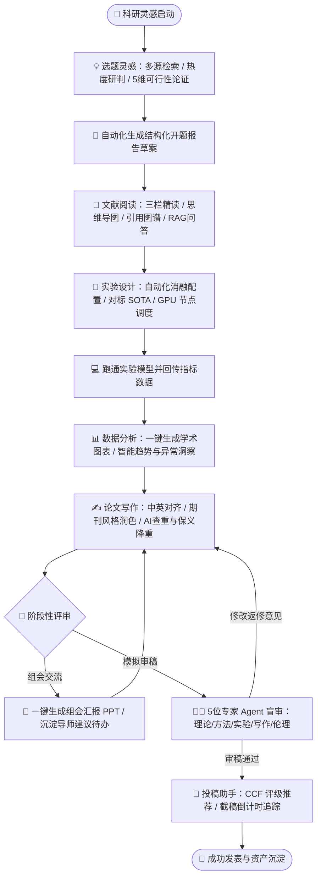

# 🧪 ScienceX · AI 科研工作台
[](https://react.dev/) [](https://www.typescriptlang.org/) [](https://vitejs.dev/) [](https://nodejs.org/) [](https://expressjs.com/) [](https://html.spec.whatwg.org/multipage/server-sent-events.html) [](https://platform.openai.com/) [](LICENSE)
> **覆盖「选题 → 文献 → 实验 → 分析 → 写作 → 投稿 → 协作」全生命周期的下一代 AI 科研生产力中枢。**  
> 对话即工作台，工具即智能体。把科研中繁复琐碎的机械劳动交给 AI，让研究人员聚焦于科学创新本身。

---

## 当前实现状态（As-Is，2026-10-02）

本仓库当前交付的是可运行的高保真演示原型，不等同于下文 TSD 描述的完整生产架构。为避免把目标设计误认为已实现能力，边界如下：

| 能力 | 当前仓库实现 | 状态 |
| :--- | :--- | :---: |
| Web 前端 | React 18 + TypeScript + Vite | 已交付 |
| API 后端 | Node.js + Express，统一 REST/SSE 契约 | 已交付 |
| 数据存储 | 本地 JSON 持久化演示 Store；无 PostgreSQL/Redis | 演示实现 |
| 模型调用 | 可选 OpenAI 兼容网关；未配置时使用模板演示回退 | 部分交付 |
| 文档导入与检索 | 支持文字内容导入、确定性关键词检索；不含真实 PDF 版面解析、OCR、Embedding/Rerank | 演示实现 |
| 任务与智能体 | 进程内任务状态机与角色化结果模拟；不含消息队列或真实多 Agent 并行调用 | 演示实现 |
| 导出与外部工具 | PPTX、MCP、GPU 集群等接口与流程已建模，但未交付真实执行器 | 目标能力 |
| 生产架构 | Java/Spring Boot、Python/FastAPI、PostgreSQL、Redis、K8s | TSD 目标架构，未随本仓库交付 |

真实模型调用需配置 `OPENAI_BASE_URL`、`OPENAI_API_KEY` 与 `OPENAI_MODEL`，或在个人设置中添加自有 OpenAI 兼容模型。未配置密钥时，界面仍可演示完整流程，但生成内容不代表真实大模型结果。

---

## 📋 项目简介

**ScienceX（科研 AI 工作台）** 致力于打破传统科研软件“各单点工具割裂、流程缺乏连续性”的痛点。不同于单纯的文献检索器、文本润色插件或数据画图脚本，ScienceX 以 **AI 原生智能体对话中枢** 为核心骨架，将科研全周期所必需的 **6 大科研工具** 与 **2 大特色协同机制**（组会汇报、多智能体专家评审团）无缝咬合为一个**数据自沉淀、上下文可追溯、智能体可编排**的科研闭环工作流。

### 🌟 核心价值主张
* 🚀 **全流程闭环**：数据在「选题灵感 ➔ 文献精读 ➔ 实验设计 ➔ 数据分析 ➔ 论文写作 ➔ 期刊投稿 ➔ 组会答辩」各模块间无缝流转，杜绝重复粘贴与信息孤岛。
* 🤖 **模型中立与高扩展**：内置主流顶尖模型，全面支持用户私有化接入任意兼容 OpenAI 协议的大模型，支持 Skills 扩展与 Model Context Protocol (MCP) 工具编排。
* ⚡ **多智能体深度协同**：首创「专家评审团」机制，模拟多位来自理论、方法、实验、写作与学术伦理维度的资深审稿人进行并行盲审与对抗裁决。
* 🔒 **学术资产沉淀与多租户**：支持个人、课题组与机构多级隔离，沉淀专属 RAG 领域向量知识库，守护学术知识产权与实验隐私。

---

## 🛠️ 技术栈

整个系统遵循现代云原生架构思想，设计为前后端完全解耦、业务逻辑与 AI 算力域各司其职的双轨混合架构。

### 1. 前端技术栈 (Frontend)

| 层次 / 模块 | 技术选型 | 版本基线 | 说明与特性 |
| :--- | :--- | :--- | :--- |
| **基础底座** | React + TypeScript + Vite | React 18.3 / TS 5.5 / Vite 5.4 | 高性能现代 SPA 架构，原生 ESM 极速热重载，严谨类型系统 |
| **路由与守卫** | React Router DOM | 6.26.2 | 声明式路由表，结合 `Suspense` 实现路由级代码分割与权限守卫 (`Guard`) |
| **状态管理** | Reactive Context & Stores | 原生轻量响应式 | 模块化隔离的认证状态 (`useAuth`) 与全局上下文缓存，零冗余依赖 |
| **设计系统** | Modern Scientific CSS System | 自定义 CSS3 Variables | 专为学术科研打造的高对比暗色/明亮配色、卡片玻璃拟态、微动效交互 |
| **图表与可视化** | Dynamic SVG Engine + ECharts 兼容 | 自研渲染层 / ECharts 5 规范 | 矢量化多指标消融柱状图、训练收敛曲线、混淆矩阵及学术级配色 |
| **实时通信** | Fetch + SSE Stream Decoder | WHATWG SSE 规范 | 支持 ReadableStream 逐 Token 渲染、进度条监听与请求中断控制器 (`AbortController`) |

### 2. 后端技术栈 (Backend)

| 模块 / 组件 | 生产架构选型 (TSD) | 演示与开发环境 | 说明与特性 |
| :--- | :--- | :--- | :--- |
| **基础服务运行时** | Java 21 + Spring Boot 3.3 | Node.js 18+ (Express 4.19) | 生产环境承载稳定高并发业务域；开发环境轻量秒级拉起，功能契约 100% 对齐 |
| **接口规范与跨域** | RESTful JSON + CORS | Express Router + CORS | 统一 `/api/v1` 前缀，严格标准化全局响应报文结构与时间戳 |
| **鉴权与会话治理** | Spring Security + JWT / OAuth2 | Token 鉴权中间件 + Session 映射 | 支持 Bearer Token 全局拦截，具备 Session 过期与刷新机制 |
| **追踪与可观测性** | OpenTelemetry + SkyWalking | `X-Request-Id` 链路追踪中间件 | 全链路贯穿请求指纹，统一捕获并分类 400xx/401xx/500xx/600xx 错误码体系 |
| **端口容错机制** | 容器编排动态解析 / DNS 发现 | 智能 `EADDRINUSE` 自适应端口自增 | 端口冲突时自动探测并递增启动，持久化写入 `.port`，前端 Vite 代理自动热发现 |
| **数据与缓存层** | PostgreSQL 16 + Redis 7 + MinIO | JSON 持久化 Store (`store.js`) | 在本地文件中持久化演示实体；不具备生产数据库的事务、并发与扩展能力 |

### 3. AI 服务与智能体架构（当前实现与目标方案）

| 核心组件 | 技术方案 | 协议 / 格式 | 说明与特性 |
| :--- | :--- | :--- | :--- |
| **模型调度网关** | 当前为 Node.js 网关；FastAPI 为目标架构 | OpenAI API 兼容规范 | 支持自定义 BaseURL 接入；无密钥或网关不可用时回退到演示模板 |
| **流式事件总线** | Server-Sent Events (SSE) | `text/event-stream` | 标准 7 类事件驱动流：`start`、`tool`、`delta`、`progress`、`reference`、`done`、`error` |
| **Agent 智能体编排** | 当前为进程内任务与模板结果；Multi-Agent 为目标 | JSON Schema + SSE progress | 已实现流程编排和进度事件，尚未实现真实并行 Agent 调用与主席汇总 |
| **RAG 知识检索增强**| 当前为文本切片 + 关键词评分；pgvector/Milvus 为目标 | 确定性检索 + 来源字段 | 可演示入库、召回和引用字段，尚未实现真实 Embedding、Rerank 与 PDF 页码解析 |
| **外部生态开放** | 当前为 MCP 目录与连接状态模拟 | MCP 适配器为目标 | 尚未交付 ArXiv、PubMed、GitHub 等真实 MCP 客户端 |

---

## 📁 目录结构

```text
Science/
├── PRD.md                       # 产品需求文档 (Product Requirements Document, v1.0)
├── TSD.md                       # 技术设计开发规范 (Technical Specification Document, v1.0)
├── README.md                    # 项目全景概览与部署文档
│
├── backend/                     # 后端 API 服务
│   ├── .port                    # 运行时动态写入的生效端口缓存 (供前端代理联动)
│   ├── package.json             # 后端依赖配置 (Express, CORS 等)
│   ├── package-lock.json
│   └── src/
│       ├── server.js            # 服务启动入口 (端口容错、全局中间件、路由装配)
│       ├── lib/
│       │   ├── ai.js            # AI 生成模拟器、SSE 流式协议引擎、异步任务编排
│       │   ├── respond.js       # 统一响应结构封装器 (ok / errors 标准化)
│       │   └── store.js         # JSON 持久化演示数据仓储 (预置学术项目/文献/GPU/期刊数据)
│       └── routes/
│           ├── account.js       # 用户认证、个人资料、模型密钥托管、用量审计、安全设置
│           ├── chat.js          # 对话工作台、会话历史、看板聚合、Skills 与 MCP
│           ├── literature.js    # 多源文献检索、选题推荐、可行性评估、开题报告任务
│           ├── documents.js     # 文档解析、思维导图、七段式总结、引用图谱、知识库
│           ├── research.js      # 实验设计、GPU 监控、SOTA 对标、图表生成、论文润色查重
│           └── publish.js       # CCF 期刊大全、投稿追踪、组会 PPT 生成、专家评审团
│
└── frontend/                    # Web 前端项目 (React 18 + TS + Vite)
    ├── index.html               # SPA 入口 HTML 模板
    ├── vite.config.ts           # Vite 构建配置 (自动读取后端端口并配置反向代理)
    ├── tsconfig.json            # TypeScript 编译配置
    ├── package.json             # 前端依赖配置 (React, React Router DOM, Vite 等)
    └── src/
        ├── main.tsx             # 前端应用挂载入口
        ├── App.tsx              # 应用根组件
        ├── api/
        │   └── client.ts        # 统一 Fetch 客户端封装与 SSE 流式解析器 (readSSE)
        ├── router/
        │   └── index.tsx        # 路由定义、懒加载配置与登录权限守卫 (Guard)
        ├── layouts/
        │   └── AppLayout.tsx    # 顶部导航、侧边工具栏、用户信息与全局状态骨架
        ├── stores/
        │   └── auth.ts          # 用户认证、Token 存取与会话响应式管理
        ├── styles/
        │   └── index.css        # 全局设计系统样式 (CSS 变量、暗黑科研风主题、排版规则)
        ├── components/
        │   └── ui.tsx           # 通用 UI 组件库 (Modal, Button, Tag, StatCard, Loading 等)
        └── pages/               # 核心业务页面 (与 PRD 架构一一映射)
            ├── Login.tsx        # 用户登录与注册页 (含一键填入演示账号)
            ├── Chat.tsx         # 💬 AI 对话工作台 (看板/多模型切换/Skills/流式应答)
            ├── Topic.tsx        # 💡 选题灵感 (多源检索/可行性雷达/开题报告生成)
            ├── Reader.tsx       # 📖 文献阅读 (三栏阅读/思维导图/七段式/引用图谱/问答)
            ├── Experiment.tsx   # 🧫 实验设计 (参数看板/GPU实时节点/消融生成/SOTA)
            ├── Analysis.tsx     # 📊 数据分析 (科研图表生成/SVG渲染/AI洞察与建议)
            ├── Writing.tsx      # ✍️ 论文写作 (润色Diff/双向翻译/AI查重/智能降重)
            ├── Submission.tsx   # 📮 投稿助手 (CCF期刊大全/截稿倒计时/匹配推荐)
            ├── Meeting.tsx      # 🎤 组会汇报 (PPTX一键生成/导师建议提取与待办化)
            ├── Review.tsx       # 🧑‍⚖️ 多智能体专家评审团 (5角色并行审稿/主审裁决)
            ├── Projects.tsx     # 📁 项目空间与课题组协同 (多项目看板/实验室知识库)
            └── Account.tsx      # ⚙️ 个人设置 (模型网关配置/用量明细/订阅与安全)
```

---

## ⚡ 核心功能模块和工作流程

### 1. 核心功能矩阵

```
🧪 ScienceX 科研工作台
│
├── 💬 AI 对话工作台 ──────── 一站式中枢：会话流式交互 / 提示词增强 / 顶部科研看板 / MCP生态
├── 💡 选题灵感 ──────────── 多源文献检索 / 选题推荐 / 可行性5维评估 / 一键开题报告
├── 📖 文献阅读 ──────────── 三栏沉浸阅读 / 逐段中英互译 / 思维导图+七段总结 / 引用图谱 / RAG精准溯源
├── 🧫 实验设计 ──────────── 参数看板 / 真实GPU集群状态监控 / 自动化消融方案矩阵 / SOTA指标库
├── 📊 数据分析 ──────────── 学术级图表智能生成 / 多类型SVG渲染 / 深度数据洞察与异常警示
├── ✍️ 论文写作 ──────────── 双栏写作视窗 / 逐词逐句Diff润色 / 专业术语翻译 / 双通道查重与降重
├── 📮 投稿助手 ──────────── CCF 推荐目录全景检索 / 截稿智能倒计时 / 论文摘要契合度期刊匹配
├── 🎤 组会汇报 ──────────── 实验进展一键排版导出 PPTX / 导师指导语音文本结构化提取为待办
├── 🧑‍⚖️ 多智能体专家评审团 ── 理论/方法/实验/写作/伦理 5 大审稿 Agent 并行评审与决策报告
└── 📁 项目与知识库 ──────── 课题组多人协作 / 项目资产关联汇总 / 领域私有 RAG 向量沉淀
```

### 2. 科研全流程端到端工作流



---

## ⚙️ 部署指南

### 1. 环境准备
确保本机或服务器安装了以下基础运行环境：
* **Node.js**：`v18.0.0` 或更高版本（推荐 `v20.x LTS`）
* **包管理器**：`npm` (v9+) / `pnpm` (v8+) / `yarn`
* **操作系统**：Windows 10/11、macOS、Linux (Ubuntu 20.04+)

### 2. 本地快速启动

项目采用前后端分离结构，提供独立服务目录，支持平滑自愈启动。

#### 步骤一：克隆仓库并安装后端依赖
```bash
cd backend
npm install
```

#### 步骤二：安装前端依赖
```bash
cd ../frontend
npm install
```

#### 步骤三：启动后端 API 服务
```bash
cd ../backend
npm run dev
# 或生产启动：npm start
```
> 💡 **智能端口自适应**：后端默认监听 `8787` 端口。如果该端口被占用，服务会自动探测并递增至可用端口（如 `8788`、`8789`...），同时将实际生效端口写入 `backend/.port` 文件。

#### 步骤四：启动前端 Web 开发服务器
```bash
cd ../frontend
npm run dev
```
> 💡 **代理动态联动**：前端 Vite 服务（默认端口 `5173`）会自动读取 `backend/.port` 记录的后端端口进行反向代理，无需人工更改配置文件即可实现接口通信打通。

#### 步骤五：访问应用
打开浏览器访问前端地址：
* **访问入口**：`http://localhost:5173`
* **内置演示账号**：`demo@sciencex.cn`
* **演示密码**：`123456`（登录页内置「一键填入演示账号」按钮）

---

### 3. 生产环境构建与部署

#### 前端静态资源编译
```bash
cd frontend
npm run build
```
编译产物将输出至 `frontend/dist/`，可直接通过 Nginx 托管。

#### 推荐 Nginx 配置示例
```nginx
server {
    listen 80;
    server_name sciencex.yourdomain.com;

    # 前端 SPA 静态托管
    location / {
        root /var/www/sciencex/frontend/dist;
        index index.html;
        try_files $uri $uri/ /index.html;
    }

    # 后端 API 与 SSE 反向代理
    location /api/ {
        proxy_pass http://127.0.0.1:8787;
        proxy_http_version 1.1;
        proxy_set_header Host $host;
        proxy_set_header X-Real-IP $remote_addr;
        proxy_set_header X-Forwarded-For $proxy_add_x_forwarded_for;

        # 针对 SSE 流式长连接特别配置
        proxy_set_header Connection '';
        proxy_buffering off;
        proxy_cache off;
        chunked_transfer_encoding on;
    }
}
```

---

## 📦 API 接口

所有接口严格遵循统一契约格式，基础路径前缀为 `/api/v1`。

### 统一响应协议
```json
{
  "code": 0,
  "message": "ok",
  "data": {},
  "timestamp": "2026-10-02T12:00:00.000Z"
}
```

### 核心接口清单

| 业务领域 | 请求方法 | 路由路径 | 接口描述 | 核心入参摘要 | 返回数据说明 |
| :--- | :---: | :--- | :--- | :--- | :--- |
| **认证与用户** | `POST` | `/api/v1/auth/login` | 用户身份验证与凭证签发 | `email`, `password` | JWT Token 与用户信息 |
| **认证与用户** | `GET` | `/api/v1/user/profile` | 获取当前登录科研人员资料 | Header Bearer Token | 研究标签、所属单位、套餐 |
| **模型管理** | `GET` | `/api/v1/models` | 获取内置及用户自定义大模型列表 | — | 模型列表与连通状态 |
| **模型管理** | `POST` | `/api/v1/models` | 接入用户私有大模型 | `base_url`, `model_name`, `api_key` | 新增模型实体 |
| **对话工作台** | `POST` | `/api/v1/chat/completions` | **SSE 流式** 对话应答中枢 | `messages[]`, `model`, `stream` | 逐字 Token 与工具调用流 |
| **对话工作台** | `GET` | `/api/v1/conversations` | 获取科研历史会话列表 | `keyword?`, `page?` | 会话分页列表 |
| **科研看板** | `GET` | `/api/v1/dashboard/summary` | 聚合项目进度与今日文献速递 | `project_id?` | 进度指标、待办、近期成果 |
| **选题灵感** | `POST` | `/api/v1/literature/search` | 多学术数据库联合检索 | `query`, `sources[]`, `has_code` | 去重文献集与检索耗时 |
| **选题灵感** | `POST` | `/api/v1/topic/recommend` | 基于兴趣标签的选题智能推荐 | `tags[]`, `history?` | 推荐方向、评分、风险研判 |
| **选题灵感** | `POST` | `/api/v1/topic/feasibility` | 选题 5 维雷达可行性深度评估 | `topic_desc` | 算力/数据/时间/创新性评分 |
| **文献研读** | `POST` | `/api/v1/documents/upload` | 上传文献或在线 URL 提交解析 | `file_name` 或 `url` | 异步任务 ID 与文档 ID |
| **文献研读** | `POST` | `/api/v1/documents/:id/analyze`| 触发思维导图与七段式总结任务 | `mode` (`mindmap` / `seven` / `all`) | 异步任务进度 ID |
| **文献研读** | `GET` | `/api/v1/documents/:id/citation-graph` | 提取文献引用关系拓扑图谱 | — | 引用节点集合与连线边 |
| **文献研读** | `POST` | `/api/v1/documents/:id/chat`| **SSE 流式** 基于单篇文献深度 RAG 问答 | `messages[]` | 答案流与段落页码溯源定位 |
| **知识库** | `POST` | `/api/v1/knowledge-bases` | 创建个人或课题组 RAG 知识库 | `name`, `scope` | 知识库实体 |
| **实验设计** | `GET` | `/api/v1/gpu/nodes` | 查询实验 GPU 集群实时负载监控 | — | 卡型、利用率、显存、温度 |
| **实验设计** | `POST` | `/api/v1/experiments/plan` | 自动化生成消融实验配置矩阵 | `goal`, `method` | 消融配置、变量定义、对比表 |
| **实验设计** | `GET` | `/api/v1/sota` | 获取任务数据集 SOTA 对标榜单 | — | 榜单方法、指标与开源情况 |
| **数据分析** | `POST` | `/api/v1/charts/generate` | 生成学术科研级图表 | `prompt`, `data?`, `template_id?` | 渲染规格数据与图表实体 |
| **数据分析** | `POST` | `/api/v1/charts/:id/analyze` | AI 深度解读实验图表数据 | — | 趋势分析、异常点检测与建议 |
| **论文写作** | `POST` | `/api/v1/writing/polish` | 学术段落精细润色 (带 Diff) | `text`, `style`, `target?` | 润色后正文与修改理由列表 |
| **论文写作** | `POST` | `/api/v1/writing/plagiarism`| AI 相似度查重与来源匹配 | `text` | 总体相似度与问题片段定位 |
| **论文写作** | `POST` | `/api/v1/writing/paraphrase`| 智能保义降重改写 | `text`, `ratio` | 降重后文本、语义保真分与Diff |
| **投稿助手** | `GET` | `/api/v1/journals` | CCF 目录期刊检索与截稿日计算 | `ccf?`, `field?`, `keyword?` | 期刊列表、级别与剩余天数 |
| **投稿助手** | `POST` | `/api/v1/journals/match` | 输入摘要进行目标期刊智能契合度推荐 | `abstract` | 推荐期刊清单、匹配度及理由 |
| **组会汇报** | `POST` | `/api/v1/deck/generate` | 实验进展一键生成汇报 PPTX | `source`, `template` | PPT 大纲与下载任务 ID |
| **组会汇报** | `POST` | `/api/v1/advice/extract` | 导师指导意见自动解析与待办拆解 | `text` 或语音标识 | 结构化意见与待办列表项 |
| **专家评审团** | `POST` | `/api/v1/review/council` | 5 位智能体并行盲审评审团会诊 | `manuscript_id`, `roles[]` | 评审任务 ID (多 Agent 协同) |
| **通用任务流** | `GET` | `/api/v1/tasks/:id/stream` | **SSE 流式** 异步耗时任务进度推送 | — | 百分比进度、当前阶段、最终结果 |

---

## 💡 总结与展望

### 1. 阶段成果总结与综合评估
* 🎯 **闭环设计完备度高**：已建立起覆盖现代科研全生命周期的产品架构。彻底打破传统工具的割裂壁垒，无论是从开题报告直接切入文献，还是从实验参数联动图表与写作润色，均实现了上下文的高效接力。
* 📐 **技术设计与规范严谨**：整体架构严格遵循高内聚低耦合原则，前后端统一了错误码分级、全链路追踪规范与标准的 SSE 事件传输协议；不仅在开发演示环境下实现了秒级启动与自动端口容错，更为生产级微服务化架构迁移预留了完整的抽象层。
* 🧪 **人机协同体验突破**：多智能体评审团、消融矩阵智能推导、段落修改 Diff 对比等细节充分考虑了科研人员的真实工作习惯，将 AI 从“问答玩具”转变为“具备科学逻辑思维的研究协作者”。

### 2. 未来演进与技术展望
1. 🧠 **端到端多模态深度科研解析**：增强对复杂 PDF 文档中跨页多栏公式、三线表格、高清折线混淆图的原生视觉多模态抽取与对齐能力。
2. 🔬 **科研代码沙箱与自动化复现**：接入安全隔离的 Docker/Wasm 代码执行沙箱，实现从文献中提取开源算法代码、自动配置运行环境并一键复现 Baseline 指标。
3. 🌐 **课题组专属混合云与私有化部署**：支持高校与科研院所一键单机/集群私有化部署，集成内部国产大模型（如 Qwen、GLM）及本地私有 GPU 资源调度。
4. 🤖 **自主闭环科研 Agent (Autonomous Science Agent)**：探索给定研究假设后，智能体能够自主检索前沿、生成假设实验代码、调度算力验证结果并撰写实验结论报告的完全自动化科研新范式。

---

*ScienceX · 让科学探索更高效，让科研创新更专注。*
