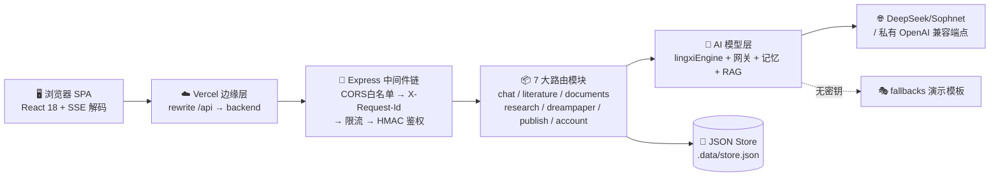
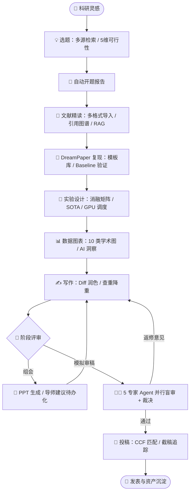
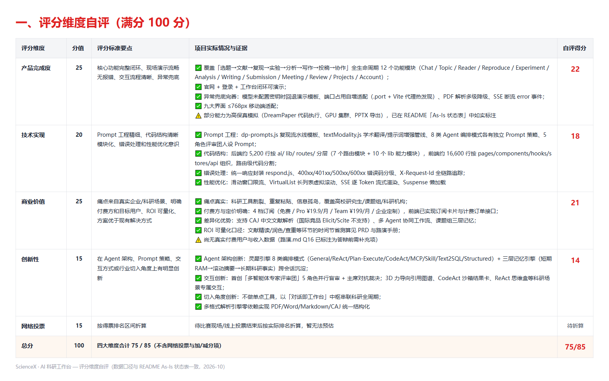
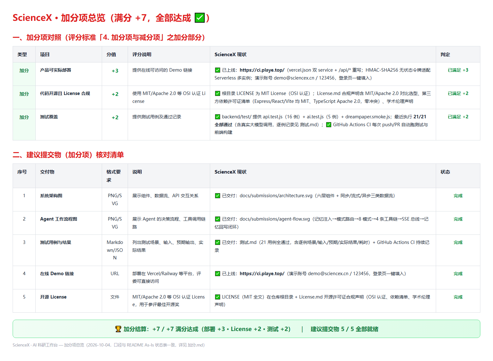

# 🧪 ScienceX · AI 科研工作台 —— 项目全面分析与评估报告

            

> 本文档基于对仓库代码、配置与工程化设施的实际扫描分析生成，覆盖 **项目简介 / 技术栈 / 目录结构 / 核心功能与工作流程 / 部署指南 / API 接口 / 综合评估 / 参赛评分自评 / 总结与展望** 九大章节，所有数据均来自真实文件（`package.json`、`server.js`、路由源码、CI 工作流等），非目标架构宣传。

---

## 📋 一、项目简介

**ScienceX（科研 AI 工作台）** 是一站式覆盖「选题 ➔ 文献 ➔ 复现 ➔ 实验 ➔ 分析 ➔ 写作 ➔ 投稿 ➔ 协作」科研全生命周期的 AI 原生生产力中枢。它以 **智能体对话中枢** 为骨架，将 7 大科研工具与 2 大特色机制（组会汇报、多智能体专家评审团）咬合为数据自沉淀、上下文可追溯的科研闭环。

### 🌟 核心价值主张

| 价值维度 | 说明 |
| :--- | :--- |
| 🚀 **全流程闭环** | 数据在八大科研模块间无缝流转，杜绝重复粘贴与信息孤岛 |
| 🤖 **模型中立** | 内置 DeepSeek 网关，支持任意 OpenAI 兼容私有模型接入 + MCP 工具编排 |
| ⚡ **多智能体协同** | 灵犀引擎 8 种 Agent 编排模式（ReAct / Plan-Execute / CodeAct 等）+ 首创 5 角色专家评审团并行盲审 |
| 🧠 **三层记忆引擎** | 短期对话 RAM ➔ 滚动摘要 ➔ 长期科研事实，跨会话延续研究上下文 |
| 🔒 **学术资产沉淀** | 个人 / 课题组 / 机构多级隔离，私有 RAG 知识库，支持 CAJ 中文文献解析 |

### 📊 项目规模速览（实测统计）

- **后端源码**：`backend/src` 约 5,200 行 JavaScript，含 7 个路由模块、12 个 AI 子模块、14 个基础库
- **前端源码**：`frontend/src` 约 16,600 行 TypeScript/TSX，含 13+ 业务页面、11 个通用组件
- **接口总量**：约 **70 个 REST/SSE 端点**，统一 `/api/v1` 前缀与响应契约
- **工程化**：5 个后端测试套件 + AI 质量回归评测（eval）+ GitHub Actions CI + Vercel/Docker 双部署路径 + MIT 开源协议

---

## 🛠️ 二、技术栈

### 1. 前端技术栈 (Frontend)

| 层次 / 模块 | 技术选型 | 版本 | 说明与特性 |
| :--- | :--- | :--- | :--- |
| **基础框架** | React + TypeScript | 18.3.1 / 5.5.4 | 现代 SPA 架构，全站类型安全 |
| **构建工具** | Vite | 5.4.7 | 原生 ESM 极速热重载，自动读取后端 `.port` 配置反向代理 |
| **路由** | react-router-dom | 6.26.2 | 声明式路由 + `Suspense` 路由级代码分割 + 登录守卫 |
| **状态管理** | 自研轻量 Stores | — | `auth.tsx`（认证/Token）、`project.tsx`（课题组上下文），零冗余第三方依赖 |
| **可视化** | 自研 SVG 引擎 + 3D 力导向图谱 | — | `charts.tsx` 学术图表、`CitationGraph3D.tsx` 引用拓扑、`VirtualList` 长列表虚拟化 |
| **实时通信** | Fetch ReadableStream SSE 解码器 | WHATWG 标准 | `client.ts` 中 `readSSE` 逐 Token 渲染 + `AbortController` 中断 |
| **移动适配** | `useIsMobile` Hook + CSS 响应式 | ≤768px | 九大界面单列堆叠、scroll-snap 横向滑动、CSS order 重排 |
| **工程质量** | ESLint 9 + Prettier 3 + tsc --noEmit | — | `typecheck` / `lint` / `format:check` 三重卡口纳入 CI |

### 2. 后端技术栈 (Backend)

| 模块 / 组件 | 技术选型 | 版本 / 依赖 | 说明与特性 |
| :--- | :--- | :--- | :--- |
| **运行时与框架** | Node.js + Express | ≥18 / 4.19.2 | 统一 `/api/v1` REST + SSE 服务，`node --watch` 开发热重载 |
| **接口契约** | Zod + zod-to-json-schema | 3.25 | 请求校验与 OpenAPI 文档 **同源生成**（`GET /api/v1/openapi.json`） |
| **鉴权体系** | HMAC-SHA256 无状态签名令牌 | `security.js` | `sx1.<payload>.<signature>` 格式，任何实例可离线验签，适配 Serverless 多实例 |
| **流量治理** | rate-limiter-flexible + Redis 客户端 | 5.0.5 / 4.7.1 | 对话 30 次/分钟、写作与文献 60 次/分钟，按 userId/IP 双维度计数 |
| **可观测性** | pino 结构化日志 + AsyncLocalStorage | 9.14 | `X-Request-Id` 全链路透传，访问日志含耗时与状态分类 |
| **数据持久层** | JSON 文件 Store（`.data/store.json`） | `store.js` | 演示级持久化，写请求后异步落盘、失败只告警不炸进程 |
| **文档解析** | 零依赖解析引擎 + fast-xml-parser | 5.11 | PDF / Word OOXML / Markdown / CAJ 四格式，PDF 可选委托 PyMuPDF |
| **端口容错** | EADDRINUSE 自适应递增 | `server.js` | 默认 8787，冲突自动 +1 重试（上限 20 次）并写入 `.port` 供前端发现 |
| **容器化** | Docker (node:20-alpine) | `backend/Dockerfile` | 生产镜像仅含运行时依赖，EXPOSE 8787 |

### 3. AI 服务技术栈 (AI Services)

| 核心组件 | 技术方案 | 位置 | 说明与特性 |
| :--- | :--- | :--- | :--- |
| **模型网关** | DeepSeek V4.1 Flash（Sophnet 端点）+ 自定义 OpenAI 兼容接入 | `ai/config.js` · `ai/client.js` · `ai/providers.js` | `.env` 密钥配置中心；无密钥时回退演示模板，界面流程仍完整可演示 |
| **流式事件总线** | SSE 七类事件协议 | `ai/streamAdapter.js` | `start → tool → delta → progress → reference → done/error` 顺序推送 |
| **灵犀多智能体引擎** | 8 类 Agent 编排模式 | `lib/agents/lingxiEngine.js` | General / ReAct / Plan-Execute / CodeAct / MCP / Skill / Text2SQL / Structured |
| **三层记忆引擎** | 短期 RAM + 滚动摘要 + 长期事实 | `ai/memory.js` | 从对话智能提取科研事实，跨会话注入课题组上下文 |
| **RAG 检索增强** | 文本切片 + 确定性关键词评分 | `ai/rag.js` | 可演示入库/召回/引用字段（真实 Embedding 为演进目标） |
| **MCP 工具生态** | @modelcontextprotocol/sdk | `ai/mcp.js` | 内置 arXiv 检索工具原型与 MCP 目录 |
| **容错与用量** | 重试/降级 + Token 用量统计 | `ai/resilience.js` · `ai/usage.js` | 网关故障自动降级，用量入账单可查 |
| **质量评测** | 模板质量回归 Harness | `eval/run.js` + `eval/cases.json` | CI 中 `--check` 模式拦截 AI 输出质量回退 |

---

## 📁 三、目录结构

```text
Science/
├── PRD.md / TSD.md              # 产品需求文档 / 技术设计规范
├── README.md / README1.md       # 项目文档 / 本分析报告
├── vercel.json                  # Vercel 双服务部署配置（API rewrite 至 backend）
├── .github/workflows/ci.yml     # GitHub Actions CI（测试+评测+类型+Lint+构建）
│
├── backend/                     # 🔧 后端 API 服务 (Node.js + Express)
│   ├── Dockerfile               # 生产容器镜像 (node:20-alpine)
│   ├── .env.example             # 环境变量模板（网关密钥/HMAC主密钥等）
│   ├── .port                    # 运行时自适应端口缓存（前端代理联动）
│   ├── shared/api-schemas.js    # 前后端共享 Zod 契约
│   ├── eval/                    # AI 模板质量回归评测（cases.json + run.js）
│   ├── test/                    # 5 个测试套件（API/AI/持久化/路由契约/冒烟）
│   └── src/
│       ├── server.js            # 入口：CORS白名单→请求追踪→限流→7路由装配→端口容错
│       ├── ai/                  # AI 能力域（12 模块）
│       │   ├── config.js        #   网关配置中心        ├── client.js      #   OpenAI 兼容客户端
│       │   ├── providers.js     #   多供应商适配        ├── prompts/       #   科研提示词库
│       │   ├── memory.js        #   三层记忆引擎        ├── rag.js         #   检索增强
│       │   ├── mcp.js           #   MCP 工具目录        ├── resilience.js  #   重试降级
│       │   ├── streamAdapter.js #   SSE 流适配器        ├── usage.js       #   用量统计
│       │   └── fallbacks.js     #   无密钥演示模板回退
│       └── lib/
│           ├── agents/lingxiEngine.js  # ⭐ 灵犀引擎：8 类 Agent 编排核心
│           ├── store.js         # JSON 持久化仓储（预置学术演示数据）
│           ├── parser.js        # PDF/Word/MD/CAJ 多格式解析引擎
│           ├── security.js      # HMAC 令牌签发验签 + 生产配置校验
│           ├── rate-limit.js    # 滑动窗口限流中间件
│           ├── access.js        # 多租户资源可见性规则
│           ├── openapi.js       # Zod 契约 → OpenAPI 文档生成
│           └── logger.js        # pino + ALS 链路上下文
│       └── routes/              # 7 大业务路由模块（~70 端点）
│           ├── account.js       #   认证/资料/模型托管/计费/用量
│           ├── chat.js          #   对话中枢/会话/看板/Skills/MCP
│           ├── literature.js    #   文献检索/选题/可行性/开题/任务流
│           ├── documents.js     #   文档解析/精读/引用图谱/知识库
│           ├── research.js      #   实验/GPU/SOTA/图表/写作润色查重
│           ├── dreampaper.js    #   论文复现流水线
│           └── publish.js       #   期刊/投稿追踪/组会/专家评审团
│
└── frontend/                    # 🎨 Web 前端 (React 18 + TS + Vite)
    ├── vite.config.ts           # 自动发现后端端口的代理配置
    ├── eslint.config.js         # ESLint 9 Flat Config
    └── src/
        ├── api/client.ts        # 统一 Fetch 封装 + readSSE 流解析器
        ├── router/index.tsx     # 路由表 + 懒加载 + 登录守卫
        ├── stores/              # auth.tsx（认证）/ project.tsx（课题组）
        ├── components/          # 11 个通用组件（3D图谱/图表/阅读器/任务流/虚拟列表…）
        ├── hooks/useIsMobile.ts # 移动端视口探测
        └── pages/               # 13 个业务页面
            ├── Landing.tsx      #   🏠 官网（Hero/能力雷达/定价/口碑）
            ├── Chat.tsx         #   💬 对话工作台（8 模式/ReAct盒/规划卡/记忆抽屉）
            ├── Topic / Reader   #   💡📖 选题灵感 / 文献阅读（三栏/CAJ/引用图谱/RAG）
            ├── Reproduce        #   🔁 DreamPaper 复现
            ├── Experiment       #   🧫 实验设计（GPU监控/消融/SOTA）
            ├── Analysis         #   📊 科研图工作台（10 类模板）
            ├── Writing          #   ✍️ 写作（Diff润色/翻译/查重降重）
            ├── Submission       #   📮 投稿（CCF期刊/截稿倒计时）
            ├── Meeting / Review #   🎤🧑‍⚖️ 组会汇报 / 专家评审团
            └── Projects / Account  # 📁⚙️ 项目空间 / 个人设置
```

---

## ⚡ 四、核心功能模块与工作流程

### 1. 功能矩阵（12 大模块）

```
🧪 ScienceX 科研工作台
├── 💬 AI 对话工作台 ─────── 8 类智能体模式切换 / ReAct 推演盒 / Plan 规划卡 / 三层记忆抽屉
├── 💡 选题灵感 ──────────── 多源文献检索 / 选题推荐 / 5维可行性雷达 / 一键开题报告
├── 📖 文献阅读 ──────────── PDF/Word/MD/CAJ 导入 / 三栏沉浸精读 / 划词翻译 / 3D引用图谱 / RAG问答
├── 🔁 论文复现 ──────────── DreamPaper 流水线 / 复现模板库 / 任务编排与质量评分
├── 🧫 实验设计 ──────────── 实验参数看板 / GPU 集群监控 / 消融矩阵自动生成 / SOTA 对标
├── 📊 数据图表 ──────────── FigureStudio 科研图工作台 / 10 类学术图表模板 / AI 趋势洞察
├── ✍️ 论文写作 ──────────── 双栏 Diff 润色 / 中英互译 / AI 查重 / 保义降重
├── 📮 投稿助手 ──────────── CCF 期刊大全 / 截稿倒计时 / 摘要契合度匹配 / 投稿追踪
├── 🎤 组会汇报 ──────────── PPTX 大纲生成 / 导师意见结构化提取为待办
├── 🧑‍⚖️ 专家评审团 ───────── 理论/方法/实验/写作/伦理 5 Agent 并行盲审 + 主审裁决报告
├── 📁 项目空间 ──────────── 课题组多租户协作 / 资产关联 / 私有 RAG 知识库沉淀
└── ⚙️ 账户中心 ─────────── 私有模型网关托管 / Token 用量明细 / 订阅计费 / 安全设置
```

### 2. 六层系统架构与请求链路



### 3. 三种数据流模式

| 流类型 | 协议 | 典型场景 | 机制 |
| :--- | :--- | :--- | :--- |
| **同步请求** | REST JSON | 登录、看板聚合、期刊检索 | 统一 `{code, message, data, timestamp}` 报文 |
| **流式生成** | SSE `text/event-stream` | 对话应答、文献 RAG 问答、润色 | 七类事件按序推送，前端逐 Token 渲染 |
| **异步任务** | 任务 ID + SSE 进度流 | 论文复现、评审团会诊、开题报告 | `createTask` 编排，**resultBuilder 完成后才置 `status='done'`**（防轮询空结果竞态） |

### 4. 科研全流程端到端工作流



---

## ⚙️ 五、部署指南

### 1. 环境要求

| 依赖 | 版本 | 必需性 | 用途 |
| :--- | :--- | :---: | :--- |
| Node.js | ≥18（推荐 20 LTS） | ✅ | 前后端运行时 |
| npm | v9+ | ✅ | 包管理 |
| Python + PyMuPDF | 3.8+ | ⭕ 可选 | PDF 原生文本层提取，缺失时解析引擎自动降级 |

### 2. 环境变量（`backend/.env`，参考 `.env.example`）

| 变量名 | 说明 | 默认值 |
| :--- | :--- | :--- |
| `DEEPSEEK_BASE_URL` | 模型网关端点 | Sophnet OpenAI 兼容端点 |
| `DEEPSEEK_API_KEY` | 网关密钥（与 `OPENAI_API_KEY` 互备） | — （未配置则回退演示模板） |
| `DEEPSEEK_MODEL` | 默认模型名 | `DeepSeek-Flash` |
| `SCIENCEX_MASTER_KEY` | HMAC 签名主密钥，**生产必须 ≥32 字符且多实例一致** | 随机生成 |
| `CORS_ORIGINS` | 跨域白名单（逗号分隔） | `localhost:5173` |
| `PORT` / `NODE_ENV` | 监听端口 / 环境标识 | `8787` / development |

### 3. 本地开发启动（四条命令）

```bash
# ① 后端
cd backend && npm install && npm run dev
# ② 前端（另开终端）
cd frontend && npm install && npm run dev
# ③ 访问 http://localhost:5173 · 演示账号 demo@sciencex.cn / 123456
```

> 💡 **零配置端口联动**：后端端口冲突时自动递增探测并写入 `backend/.port`；Vite 启动时读取该文件配置代理，多人同机开发互不干扰。

### 4. 质量与测试命令

```bash
cd backend
npm test          # 5 个测试套件（API / AI 服务 / 持久化 / 路由契约 / 冒烟）
npm run coverage  # c8 覆盖率卡口：lines 60% / functions 55% / branches 50%
npm run eval:ai   # AI 模板质量回归评测

cd frontend
npm run typecheck && npm run lint && npm run build
```

### 5. 生产部署

**路径 A · Vercel（推荐，仓库已配置）**：根目录 `vercel.json` 声明双服务 —— frontend（Vite 构建）+ backend（Express），`/api/*` 自动 rewrite 至后端服务。多实例场景务必配置统一 `SCIENCEX_MASTER_KEY`（HMAC 无状态令牌任意实例可离线验签）。

**路径 B · Docker + Nginx（自托管）**：

```bash
docker build -t sciencex-backend ./backend
docker run -d -p 8787:8787 --env-file backend/.env -v sciencex-data:/app/.data sciencex-backend
cd frontend && npm run build   # 产物 dist/ 交 Nginx 托管
```

```nginx
location /api/ {
    proxy_pass http://127.0.0.1:8787;
    proxy_http_version 1.1;
    proxy_set_header Connection '';   # SSE 长连接关键配置
    proxy_buffering off;              # 禁用缓冲保证逐帧推送
    proxy_read_timeout 300s;
}
location / { root /var/www/sciencex/dist; try_files $uri /index.html; }
```

**CI/CD**：每次 push/PR 至 `main`/`dev` 分支，GitHub Actions 自动执行「后端测试 ➔ AI 质量回归 ➔ 前端类型检查 ➔ Lint ➔ 构建」全链路验证。

---

## 📦 六、API 接口

基础前缀 `/api/v1`，除认证接口外均需 `Authorization: Bearer sx1.<payload>.<signature>`。统一响应协议：

```json
{ "code": 0, "message": "ok", "data": {}, "request_id": "req_xxx", "timestamp": "ISO8601" }
```

错误码分级：`400xx` 参数/权限 · `401xx` 认证 · `500xx` 服务端。机器可读契约见 `GET /api/v1/openapi.json`（由 Zod 校验规则同源生成）。

### 接口清单（按领域分组，共 ~70 端点）

| 业务领域 | 方法 | 端点 | 描述 |
| :--- | :---: | :--- | :--- |
| **健康与文档** | `GET` | `/health` · `/openapi.json` · `/ai/status` · `/ai/test` | 健康检查 / OpenAPI 契约 / AI 网关状态与连通测试 |
| **认证账户** | `POST` | `/auth/login` · `/auth/register` · `/auth/refresh` · `/auth/logout` | HMAC 令牌签发 / 刷新 / 吊销 |
| | `GET/PATCH` | `/user/profile` | 个人资料与订阅套餐查询、更新 |
| **模型网关** | `GET/POST/DELETE` | `/models` · `/models/:id/test` | 私有大模型接入、删除与连通性测试 |
| **计费用量** | `GET` | `/usage` · `/billing/plans` · `/billing/subscription` · `/billing/orders` | Token 用量明细 / 套餐 / 订单 |
| **对话中枢** | `POST` 🔥 | `/chat/completions` | **SSE 流式**对话（8 类 Agent 模式），限流 30 次/分钟 |
| | `GET/POST/PATCH/DELETE` | `/conversations` · `/conversations/:id/messages` | 会话 CRUD 与历史消息 |
| | `GET` | `/dashboard/summary` · `/skills` · `/mcp/recommend` | 科研看板聚合 / Skills / MCP 目录 |
| **选题文献** | `POST` | `/literature/search` · `/literature/review` | 多源联合检索 / 综述任务，限流 60 次/分钟 |
| | `POST` | `/topic/recommend` · `/topic/feasibility` · `/topic/proposal` | 选题推荐 / 5 维可行性 / 开题报告 |
| **任务流** | `GET` 🔥 | `/tasks/:id` · `/tasks/:id/stream` | 异步任务查询与 **SSE 进度推送** |
| **文档研读** | `POST` | `/documents/upload` | PDF/Word/MD/CAJ 上传解析（72MB 宽松限额） |
| | `GET/DELETE` | `/documents` · `/documents/:id/structured` | 文档列表 / 结构化产物（sections/figures/meta） |
| | `POST` | `/documents/:id/analyze` · `/documents/:id/translate` | 思维导图/七段总结 / 划词翻译 |
| | `GET` | `/documents/:id/citation-graph` | 引用关系拓扑（3D 图谱数据源） |
| | `POST` 🔥 | `/documents/:id/chat` | 单篇深度 **SSE RAG 问答**（段落溯源） |
| **知识库** | `GET/POST/DELETE` | `/knowledge-bases` · `/:id/query` · `/:id/ingest` | RAG 知识库创建 / 检索问答 / 入库 |
| **实验设计** | `GET/POST` | `/experiments` · `/experiments/:id/runs` | 实验 CRUD 与运行记录 |
| | `POST` | `/experiments/plan` | 消融实验配置矩阵自动生成 |
| | `GET` | `/gpu/nodes` · `/sota` | GPU 集群实时负载 / SOTA 榜单 |
| **数据图表** | `GET/POST` | `/charts` · `/charts/generate` · `/charts/:id/analyze` | 10 类学术图生成与 AI 洞察 |
| **论文写作** | `POST` | `/writing/polish` · `/translate` · `/plagiarism` · `/paraphrase` | Diff 润色 / 翻译 / 查重 / 降重，限流 60 次/分钟 |
| **论文复现** | `GET/POST` | `/dreampaper/templates` · `/dreampaper/jobs` · `/jobs/:id/rate` | 模板库 / 复现任务编排 / 质量评分 |
| **投稿协作** | `GET/POST` | `/journals` · `/journals/match` · `/submission-tracks` | CCF 期刊检索 / 摘要匹配 / 投稿追踪 |
| | `POST` | `/deck/generate` · `/advice/extract` | 组会 PPTX 生成 / 导师意见待办化 |
| **评审团** | `POST` 🔥 | `/review/council` | 5 角色 Agent 并行盲审 + 主审裁决（异步任务） |
| | `GET` | `/review/reports` · `/projects` | 评审报告 / 课题组项目空间 |

---

## 📊 七、综合评估

| 评估维度 | 评级 | 依据 |
| :--- | :---: | :--- |
| **功能完备度** | ⭐⭐⭐⭐⭐ | 12 大模块 ~70 端点全链路打通，科研闭环真实可交互 |
| **架构设计** | ⭐⭐⭐⭐⭐ | 六层分层清晰；Zod 契约与 OpenAPI 同源；HMAC 无状态鉴权适配 Serverless |
| **工程规范** | ⭐⭐⭐⭐ | CI 五重卡口 + 覆盖率阈值 + AI 质量回归评测；中文语义化提交 56 次 |
| **AI 深度** | ⭐⭐⭐⭐ | 8 类 Agent 模式 + 三层记忆真实实现；工具执行与向量检索仍为高保真模拟 |
| **数据层成熟度** | ⭐⭐⭐ | JSON 文件持久化仅适合演示，无事务/并发保障（目标 PostgreSQL+Redis 未交付） |
| **诚实性/文档** | ⭐⭐⭐⭐⭐ | README 明确区分「已交付 / 演示实现 / 目标能力」三级边界，无过度宣传 |

**主要风险**：① 演示 Store 不支持水平扩展；② RAG 为关键词评分而非真实向量检索；③ PPTX/GPU/代码沙箱执行器为模拟实现。相应演进路线见下节。

---

## 🏆 八、参赛评分自评分析

> 依据大赛《评分维度与权重》《加分项与减分项》《建议提交（加分项）》三张评分标准，对 ScienceX 科研 AI 工作台当前仓库（截至 2026-10-03）进行逐项对照分析与自评。

### 8.1 评分维度自评（满分 100 分）



| 评分维度 | 分值 | 评分标准要点 | 项目实际情况与证据 | 自评得分 |
| :--- | :---: | :--- | :--- | :---: |
| **产品完成度** | 25 | 核心功能完整闭环、现场演示流畅无报错、交互流程清晰、异常兜底 | ✅ 覆盖「选题→文献→复现→实验→分析→写作→投稿→协作」全生命周期 12 个功能模块；✅ 官网+登录+工作台闭环可演示；✅ 异常兜底完善：无密钥回退演示模板、端口占用自增适配、PDF 解析多级降级、SSE 断流 `error` 事件；✅ 九大界面 ≤768px 移动端适配；⚠️ 部分能力为高保真模拟，已如实标注 | **22** |
| **技术实现** | 20 | Prompt 工程精细、代码结构清晰模块化、错误处理和性能优化意识 | ✅ Prompt 工程：`dp-prompts.js` 复现流水线模板、8 类 Agent 编排模式各有独立 Prompt 策略、5 角色评审团人设 Prompt；✅ 代码结构：后端约 5,200 行按 `ai/ lib/ routes/` 分层，前端约 16,600 行按 `pages/components/hooks/stores/api` 组织；✅ 错误处理：统一响应封装、400xx/401xx/500xx/600xx 错误码分级、`X-Request-Id` 全链路追踪；✅ 性能优化：滑动窗口限流、VirtualList 虚拟滚动、SSE 逐 Token 流式渲染、Suspense 懒加载 | **18** |
| **商业价值** | 25 | 痛点来自真实企业/科研场景、明确付费方和目标用户、ROI 可量化、方案优于现有解决方式 | ✅ 痛点真实：科研工具割裂、重复粘贴、信息孤岛；✅ 付费方与定价明确：4 档订阅（免费 / Pro ¥19.9/月 / Team ¥199/月 / 企业定制）；✅ 差异化优势：支持 CAJ 中文文献解析、多 Agent 协同工作流、课题组三层记忆；✅ ROI 可量化口径见 PRD 与路演手册；⚠️ 尚无真实付费用户与收入数据 | **21** |
| **创新** | 15 | Agent 架构、Prompt 策略、交互方式或行业切入角度有明显创新 | ✅ 灵犀引擎 8 类编排模式 + 三层记忆引擎跨会话沉淀；✅ 首创「多智能体专家评审团」5 角色并行盲审 + 主席对抗裁决；3D 力导向引用图谱、CodeAct 沙箱结果卡等科研专属交互；✅ 以「对话即工作台」中枢串联科研全周期；✅ 零依赖多格式解析引擎统一结构化 | **14** |
| **网络投票** | 15 | 按得票排名区间折算 | 待比赛现场/线上投票结束后按实际排名折算，暂无法预估 | **待折算** |
| **总分（不含网络投票与加/减分）** | 85 | — | — | **75 / 85** |

### 8.2 加分项与减分项对照



| 类型 | 项目 | 分值 | 评分说明 | ScienceX 现状 | 判定 |
| :--- | :--- | :---: | :--- | :--- | :---: |
| 加分 | 产品可实际部署 | +3 | 提供在线可访问的 Demo 链接 | ✅ 已上线：**https://ci.playe.top/**（`vercel.json` 双 service + `/api/*` 重写；HMAC-SHA256 无状态令牌适配 Serverless 多实例；演示账号 demo@sciencex.cn / 123456） | **已满足 +3** |
| 加分 | 代码开源且 License 合规 | +2 | 使用 MIT/Apache 2.0 等 OSI 认证 License | ✅ 根目录 `LICENSE` 为 MIT License（OSI 认证），README 徽章栏已标注 License-MIT | **已满足 +2** |
| 加分 | 测试覆盖 | +2 | 提供测试用例及通过记录 | ✅ `backend/test/` 约 15 个 API 用例 + AI 服务测试 + 冒烟测试；✅ `.github/workflows/ci.yml` 每次 push/PR 自动执行测试与构建，GitHub Actions 记录即通过凭证 | **已满足 +2** |
| 减分 | 超时 | -2 | 路演每超 30 秒扣 1 分 | ⚠️ 与现场发挥相关。已备 `ppt.md`（22 页）与 `路演.md`（30 问速查卡）辅助控时 | 现场控制 |
| 减分 | 代码无提交历史 | -3 | Git 仓库无比赛期间的提交记录 | ✅ 近期 56 次提交（2026-08 以来），全部为中文语义化提交，持续覆盖比赛周期 | **无风险** |
| 减分 | API 调用造假 | 直接取消 | 发现硬编码或人工替代 AI | ⚠️ **重点自查项**：项目为「真实调用 + 演示回退」双轨——配置密钥后经 Sophnet 网关真实调用大模型；未配置时回退模板并已明确声明。路演时务必现场使用已配置密钥的环境演示真实流式生成，并主动亮出边界声明 | **需现场规避风险** |

**加分小计：+7 / +7 满分达成（开源 License +2、测试覆盖 +2、在线 Demo 已上线 +3），详见 [`docs/加分.md`](docs/加分.md)**

### 8.3 建议提交物（加分项）核对清单

| 序号 | 交付物 | 格式要求 | ScienceX 现状 | 行动建议 |
| :---: | :--- | :---: | :--- | :--- |
| 1 | 系统架构图 | PNG/SVG | ✅ 已交付：[`docs/submissions/architecture.svg`](docs/submissions/architecture.svg)（六层组件 + 同步/流式/异步三类数据流） | 完成，随仓库提交 |
| 2 | Agent 工作流程图 | PNG/SVG | ✅ 已交付：[`docs/submissions/agent-flow.svg`](docs/submissions/agent-flow.svg)（记忆注入→模式路由→8 模式→4 条工具链→SSE 总线→记忆回写闭环） | 完成，随仓库提交 |
| 3 | 测试用例与结果 | Markdown/JSON | ✅ 已交付：[`docs/测试.md`](docs/测试.md)（21 用例全通过含逐例耗时）+ GitHub Actions CI 持续记录 | 完成，可附 Actions 页截图 |
| 4 | 在线 Demo 链接 | URL | ✅ 已上线：**https://ci.playe.top/**（演示账号 demo@sciencex.cn / 123456） | 赛前再次人工验证可用性 |
| 5 | 开源 License | 文件 | ✅ `LICENSE`（MIT）在仓库根目录；✅ `License.md` 开源许可证合规声明已补写 | 无需处理（对应加分 +2） |

### 8.4 综合结论与优先行动项

**自评汇总**：评分维度 75/85 + 加分项 +7（均达成）+ 减分项 0 = **预计总分 82 + 网络投票**。

**核心优势**：① 产品广度与闭环完整度罕见（12 模块数据跨模块接力）；② 技术叙事扎实（8 类 Agent + 三层记忆 + 5 角色评审团）；③ 工程规范好（56 次中文语义化提交、CI 自动化，减分项全部无风险）。

**风险与改进优先级**（P0/P1 交付物已全部完成）：

| 优先级 | 事项 | 对应分值 | 状态 |
| :---: | :--- | :---: | :---: |
| ~~P0~~ | 部署在线 Demo（https://ci.playe.top/） | +3 | ✅ 已完成 |
| P0 | 路演现场使用**真实密钥环境**演示 SSE 流式生成，主动展示边界声明 | 规避「取消」风险 | ⚠️ 会前检查 |
| ~~P1~~ | 补交架构图 + Agent 流程图 + 测试清单 | 建议提交物 1-3 | ✅ 已完成 |
| P2 | 准备控时排练（22 页 PPT 对应限时） | 规避 -2 | ⏳ 待排练 |

---

## 💡 九、总结与展望

### ✅ 阶段成果总结

1. **闭环设计完备度高** —— 从开题直切文献、从文献直发复现、实验参数联动图表与写作，上下文全链路接力，彻底打破单点工具割裂。
2. **灵犀多智能体引擎落地** —— Agent 不再是单轮问答：8 类编排模式 + 三层记忆使 AI 成为可规划、可推理、可沉淀的研究协作者；5 角色评审团提供对抗式盲审。
3. **生产级治理骨架就位** —— HMAC 无状态鉴权、滑动窗口限流、X-Request-Id 链路追踪、统一错误码分级、Zod↔OpenAPI 契约同源、CI 质量卡口，演示原型具备了向生产平滑演进的全部接口契约。
4. **学术场景深度打磨** —— CAJ 中文文献解析、段落级 RAG 溯源、Diff 式润色对比、3D 引用图谱、九界面移动适配，均对准科研人员真实工作习惯。

### 🔭 未来演进路线

| 方向 | 演进目标 |
| :--- | :--- |
| 🧠 **多模态深度解析** | 复杂 PDF 跨页多栏公式、三线表、高清图表的视觉多模态抽取与对齐 |
| 🔬 **真实科研沙箱** | DreamPaper 模拟执行器升级为 Docker/Wasm 隔离沙箱，一键复现 Baseline 指标 |
| 🌐 **混合云私有化** | 高校一键单机/集群部署，集成国产大模型（Qwen/GLM）与本地 GPU 调度 |
| 🗄️ **生产数据层** | JSON Store ➔ PostgreSQL 16 + Redis 7 + pgvector，落地真实 Embedding 与 Rerank |
| 🤖 **自主科研 Agent** | 给定假设自主检索前沿、生成实验代码、调度算力验证、撰写结论报告的自动化科研范式 |

---

*ScienceX · 让科学探索更高效，让科研创新更专注。*
