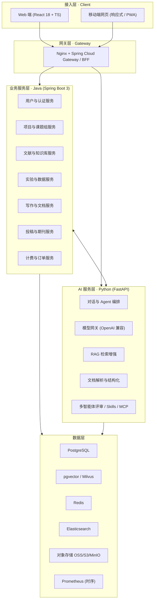
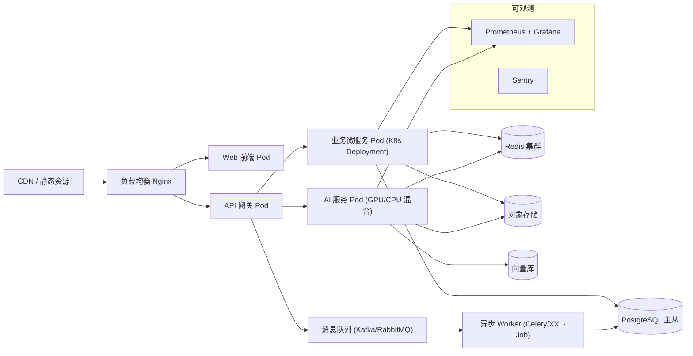
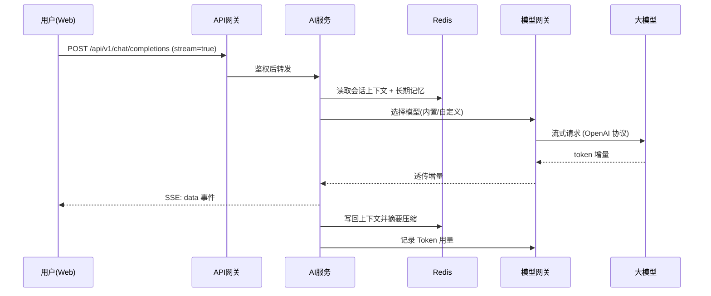
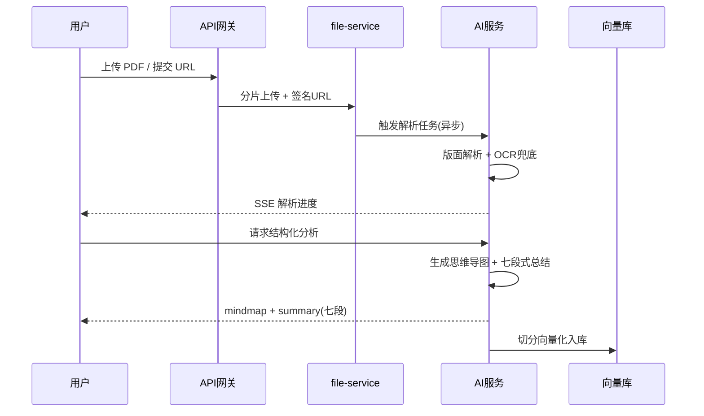
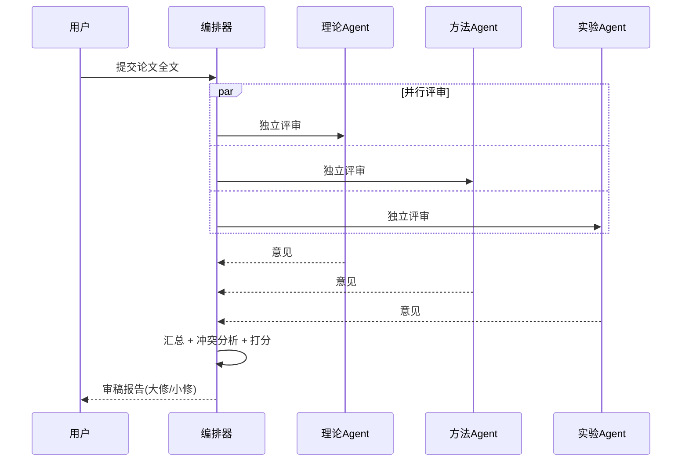
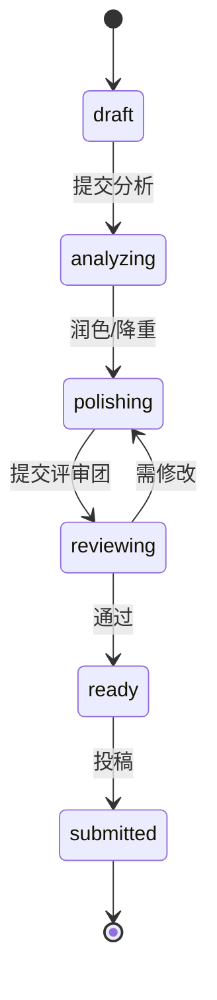
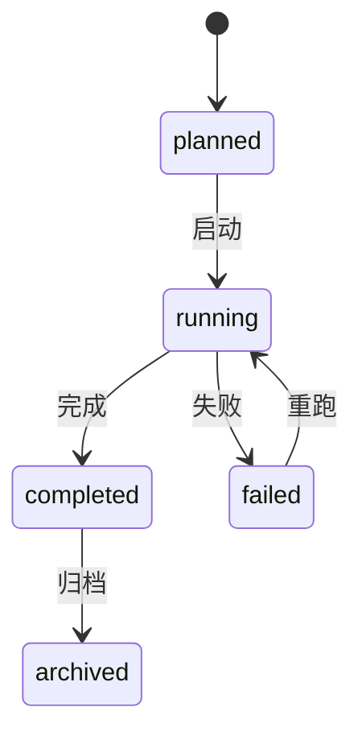
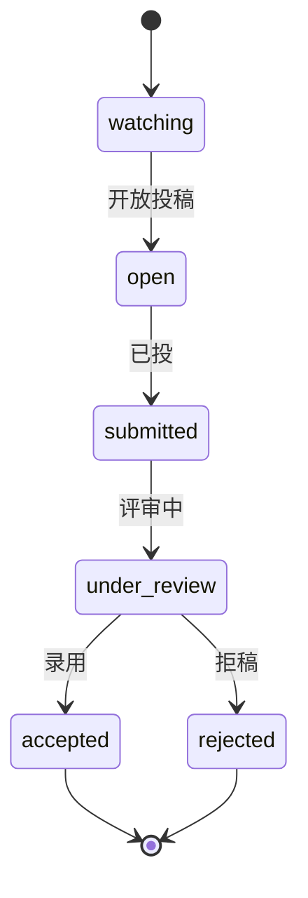
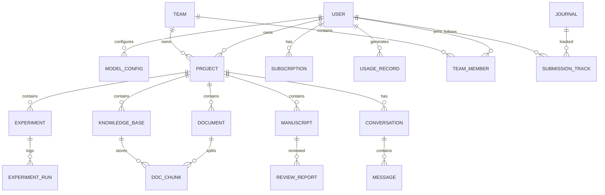

# 🛠️ ScienceX · AI 科研工作台 —— 技术开发设计规范（TSD）

> **文档版本**：v1.0
> **文档类型**：技术设计说明书（Technical Design Document, TSD）
> **产品代号**：ScienceX / 科研 AI 工作台
> **上游文档**：`PRD.md` v1.0（产品需求文档）
> **撰写角色**：技术负责人 / 架构师
> **最后更新**：2026-10-01
> **适用对象**：前端 / 后端 / AI 工程 / 测试 / DevOps

---

## 📖 阅读指引

| 章节 | 内容 | 主要读者 |
| --- | --- | --- |
| 一、总体架构设计 | 分层架构、部署拓扑、技术栈、需求追溯 | 全体 |
| 二、模块划分与职责 | 微服务/AI/前端模块边界与对应功能 | 后端 / 前端 / AI |
| 三、核心技术方案选型 | 11 项关键技术方案与选型理由 | 架构 / AI 工程 |
| 四、关键流程与数据模型 | 时序图、状态机、ER 模型、核心表结构 | 后端 / DBA |
| 五、接口定义 | 规范、清单、SSE 协议、开放接口 | 前端 / 后端 / 测试 |
| 六、异常与边界处理 | 错误码、边界场景、容错策略 | 后端 / 测试 |
| 七、性能与安全考量 | SLO、优化策略、安全与合规 | 架构 / 运维 / 安全 |
| 八、开发规范与测试验收 | 代码/Git/CI 规范、测试策略、DoD | 全体 |

> **约定**：本文档中所有 `REQ-xxx` 编号与 `PRD.md` 功能点一一对应，见 [1.5 需求追溯矩阵](#15-需求追溯矩阵)。

---

## 一、总体架构设计

### 1.1 🎯 设计目标与原则

| 原则 | 说明 | 对应 PRD |
| --- | --- | --- |
| 前后端分离 | 前端 SPA/SSR 与后端 API 完全解耦，独立部署、独立迭代 | PRD §4.2 |
| 双语言后端各司其职 | Java 承载业务域（稳），Python 承载 AI 域（生态强） | PRD §4.2 |
| AI 原生 | Agent 编排、RAG、模型网关为一等公民，非外挂能力 | PRD §三 |
| 模型中立 | 统一 OpenAI 兼容协议，用户可接任意模型 | PRD §2.1 |
| 多租户隔离 | 个人 / 课题组 / 机构三级隔离，行级权限 | PRD §2.4/§2.5 |
| 多端适配 | 一套 API 服务 Web 与移动端，响应式优先 | PRD §1.1/§4.1 |
| 可观测可扩展 | Skills / MCP 开放扩展，全链路监控 | PRD §4.2 |

### 1.2 🏗️ 总体分层架构



### 1.3 🚀 部署拓扑



> 部署形态：Docker + Kubernetes，支持多副本、HPA 弹性伸缩、灰度发布（Argo Rollouts）。机构版支持**私有化单机/集群部署**（PRD §6.1 Enterprise）。

### 1.4 🧰 技术栈与版本锁定

| 层 | 组件 | 选型 | 版本基线 | 对应 PRD |
| --- | --- | --- | --- | --- |
| 前端 | 框架 | React + TypeScript + Vite | React 18 / TS 5.x / Vite 5 | §4.1 |
| 前端 | 状态/数据 | Zustand + TanStack Query | Zustand 4 / TQ 5 | §4.1 |
| 前端 | UI | Ant Design + Tailwind CSS | AntD 5 / Tailwind 3 | §4.1 |
| 前端 | 阅读器 | PDF.js | pdfjs-dist 4.x | §2.2.2 |
| 前端 | 图表/图谱 | ECharts + D3.js / Cytoscape | ECharts 5 / D3 7 | §2.2.2/§2.2.4 |
| 移动端 | 适配 | 响应式 + PWA | — | §1.1 |
| 网关 | 接入 | Nginx + Spring Cloud Gateway | Nginx 1.25 / SCG 4.x | §4.1 |
| 后端 | 业务 | Java + Spring Boot | JDK 21 / Boot 3.3 | §4.1 |
| 后端 | AI | Python + FastAPI | Python 3.11 / FastAPI 0.11x | §4.1 |
| 后端 | 编排 | LangChain / LlamaIndex | 最新稳定版 | §4.1 |
| 后端 | 异步 | Celery / XXL-Job + Redis | Celery 5.x | §4.1 |
| 数据 | 关系库 | PostgreSQL | 16 | §4.1 |
| 数据 | 向量库 | pgvector / Milvus | pgvector 0.7 / Milvus 2.4 | §4.1 |
| 数据 | 缓存 | Redis | 7.x | §4.1 |
| 数据 | 搜索 | Elasticsearch | 8.x | §4.1 |
| 数据 | 对象存储 | S3 / OSS / MinIO | — | §4.1 |
| 基础设施 | 部署 | Docker + Kubernetes | K8s 1.29 | §4.1 |
| 基础设施 | CI/CD | GitHub Actions / Jenkins + ArgoCD | — | §4.1 |
| 基础设施 | 监控 | Prometheus + Grafana + Sentry | — | §4.1 |

### 1.5 需求追溯矩阵

| 需求编号 | PRD 功能点 | 本设计对应章节 | 优先级 |
| --- | --- | --- | --- |
| REQ-CHAT-01 | 对话引擎 / 多轮对话 / 历史记录 | 3.2 / 3.7 / 4.1 / 5.3 | P0 |
| REQ-CHAT-02 | 多模型选择 + OpenAI 协议自定义接入 | 3.1 / 5.3 | P0 |
| REQ-CHAT-03 | 提示词增强 / 语音输入 / Skills / MCP 推荐 | 3.2 / 5.5 | P1/P2 |
| REQ-CHAT-04 | 顶部进度看板 / 最近产出 / 今日文献速递 | 3.8 / 2.2 / 5.3 | P1 |
| REQ-LIT-01 | 多源文献检索 / 综述论文 / 开源代码论文 | 2.2 / 3.3 / 5.3 | P0/P1 |
| REQ-LIT-02 | 选题推荐 / 可行性评估 / 开题报告 | 2.2 / 3.3 / 5.3 | P0/P1 |
| REQ-READ-01 | 多格式导入 / 三栏式阅读器 | 3.4 / 2.3 / 5.3 | P0 |
| REQ-READ-02 | 翻译 / 结构化分析(思维导图+七段) / 引用图谱 / 代码复现 | 3.5 / 3.10 / 5.3 | P0/P1/P2 |
| REQ-READ-03 | 右侧 Agent 对话 / 多人协同 / 历史 | 3.7 / 3.11 / 5.4 | P0 |
| REQ-READ-04 | 知识库沉淀 | 3.3 / 4.3 | P1 |
| REQ-EXP-01 | 实验参数看板 / GPU 可视化管理 | 2.1 / 3.8 / 5.3 | P0/P1 |
| REQ-EXP-02 | 方案生成 / SOTA 性能指标 | 3.2 / 3.8 / 5.3 | P0/P1 |
| REQ-ANA-01 | 科研图表生成(image2) / 示例图表库 | 3.9 / 5.3 | P1/P2 |
| REQ-ANA-02 | 图表数据分析 / 数据建议 | 3.9 / 5.3 | P1 |
| REQ-WRT-01 | 左侧阅读器 + 中英互译 / 润色 / 查重 / 降重 | 3.4 / 3.3 / 5.3 | P0/P1 |
| REQ-SUB-01 | CCF 期刊大全 / 投稿倒计时 / 期刊匹配 | 2.1 / 3.8 / 5.3 | P1/P2 |
| REQ-SPC-01 | 组会 PPT 制作 / 导师建议记录 | 2.2 / 3.8 / 5.3 | P1 |
| REQ-SPC-02 | 多智能体专家评审团 | 3.6 / 4.1 / 5.3 | P1/P2 |
| REQ-PRJ-01 | 项目管理 / 课题组 / RAG 知识库 | 2.1 / 3.11 / 4.3 | P0/P1 |
| REQ-USER-01 | 资料与偏好 | 2.1 / 5.3 | P0 |
| REQ-USER-02 | 模型管理（自定义大模型 + 密钥） | 3.1 / 2.1 / 7.3 | P0 |
| REQ-USER-03 | 用量统计 | 3.8 / 5.3 | P1 |
| REQ-USER-04 | 订阅套餐（支付/订单/发票） | 2.1 / 6.3 | P1 |
| REQ-USER-05 | 安全与数据（密码/2FA/导出/删除/授权） | 7.3 / 7.4 / 5.3 | P0 |

---

## 二、模块划分与职责

### 2.1 🧩 后端业务微服务（Java / Spring Boot）

| 服务 | 职责边界 | 对应需求 | 核心依赖 | 优先级 |
| --- | --- | --- | --- | --- |
| `auth-service` | 注册登录、OAuth2/JWT、2FA、会话与授权 | REQ-USER-05 | Redis, PG | P0 |
| `user-service` | 用户资料、偏好、研究方向标签、语言设置 | REQ-USER-01 | PG | P0 |
| `project-service` | 项目空间、聚合看板、项目内资源关联 | REQ-PRJ-01 | PG, OSS | P0 |
| `team-service` | 课题组、成员邀请、RBAC、协作评论 | REQ-PRJ-01 | PG | P1 |
| `literature-service` | 文献元数据、多源检索聚合、去重、期刊库 | REQ-LIT-01 | PG, ES, 外部 API | P0 |
| `knowledge-service` | 知识库管理、文档分块、向量检索代理 | REQ-READ-04, REQ-PRJ-01 | PG, 向量库 | P0 |
| `experiment-service` | 实验参数看板、方案记录、GPU 节点与任务 | REQ-EXP-01/02 | PG, Prometheus | P0 |
| `writing-service` | 稿件管理、版本、导出（Word/PDF/LaTeX） | REQ-WRT-01 | PG, OSS | P0 |
| `submission-service` | CCF 期刊库、关注与倒计时、提醒通知 | REQ-SUB-01 | PG, 调度中心 | P1 |
| `billing-service` | 套餐、订阅、订单、支付回调、发票、用量计费 | REQ-USER-03/04 | PG, 支付网关 | P1 |
| `notify-service` | 站内信、邮件、Webhook、倒计时提醒 | REQ-CHAT-04, REQ-SUB-01 | MQ | P1 |
| `file-service` | 文件上传/分片/断点续传、格式识别、签名 URL | 全局 | OSS | P0 |

### 2.2 🤖 AI 服务模块（Python / FastAPI）

| 模块 | 职责边界 | 对应需求 | 关键实现 |
| --- | --- | --- | --- |
| `agent-orchestrator` | 意图识别、任务规划、工具调用、多智能体编排 | REQ-CHAT-01, REQ-SPC-02 | LangChain/LlamaIndex + 自研编排 |
| `model-gateway` | 统一模型接入、路由、限流、重试、Token 计费 | REQ-CHAT-02, REQ-USER-02 | OpenAI 兼容协议 + 适配器 |
| `rag-engine` | 文档切分、Embedding、检索、Rerank、溯源 | REQ-READ-04, REQ-PRJ-01 | pgvector/Milvus + Reranker |
| `doc-parser` | PDF/Word/LaTeX/MD/网页解析、OCR、版面还原 | REQ-READ-01 | MinerU/GROBID + pdfplumber |
| `paper-analyzer` | 翻译、思维导图、七段式总结、引用图谱数据 | REQ-READ-02 | LLM + 图谱构建 |
| `review-council` | 多角色专家评审、冲突分析、审稿报告 | REQ-SPC-02 | 多 Agent 并行编排 |
| `chart-studio` | 图表生成（image2）、Vision 解读、分析建议 | REQ-ANA-01/02 | image2 生成 + 多模态 LLM |
| `deck-builder` | 组会 PPT 生成、导师建议结构化抽取 | REQ-SPC-01 | LLM + 模板引擎 + python-pptx |
| `skill-mcp-hub` | Skills 注册与执行、MCP 客户端与推荐 | REQ-CHAT-03 | Skill Registry + MCP Client |
| `asr-service` | 语音转写（对话输入 + 组会记录） | REQ-CHAT-03, REQ-SPC-01 | Whisper / Web Speech |

### 2.3 🖥️ 前端模块划分（React + TS）

| 模块 | 页面/组件 | 职责 | 对应需求 |
| --- | --- | --- | --- |
| `workbench-chat` | 对话工作台 | 流式对话、多模型切换、Skills/MCP、顶部三卡片 | REQ-CHAT-01~04 |
| `module-topic` | 选题灵感 | 检索、推荐、可行性、开题报告 | REQ-LIT-01/02 |
| `module-reader` | 三栏阅读器 | 左阅读 / 中分析 / 右 Agent，翻译+思维导图+图谱 | REQ-READ-01~03 |
| `module-experiment` | 实验设计 | 参数看板、GPU 面板、方案、SOTA | REQ-EXP-01/02 |
| `module-analysis` | 数据分析 | 图表生成、示例库、解读建议 | REQ-ANA-01/02 |
| `module-writing` | 论文写作 | 阅读器 + 翻译/润色/查重/降重功能键 | REQ-WRT-01 |
| `module-submission` | 投稿助手 | CCF 期刊库、倒计时、匹配推荐 | REQ-SUB-01 |
| `module-meeting` | 组会汇报 | PPT 生成、导师建议记录 | REQ-SPC-01 |
| `module-review` | 专家评审团 | 多智能体评审与报告 | REQ-SPC-02 |
| `module-project` | 我的项目 | 项目管理、课题组、RAG 知识库 | REQ-PRJ-01 |
| `module-account` | 个人中心 | 资料偏好、模型管理、用量、订阅、安全 | REQ-USER-01~05 |
| `shared-core` | 公共层 | 路由、错误边界、请求封装、SSE 客户端、权限指令 | 全局 |

### 2.4 🔗 模块依赖与调用约束

| 约束 | 规则 |
| --- | --- |
| 前后端 | 前端仅通过网关调用后端/AI，不直连数据库或内部服务 |
| 业务 ↔ AI | 业务服务通过内部 HTTP/gRPC 调用 AI 服务；AI 不直接写业务库，经业务服务落库 |
| 服务间 | 同步用 REST（内部），异步用消息队列；禁止跨服务直连数据库 |
| 依赖方向 | 数据层（PG/向量/Redis）只被对应归属服务访问，AI 服务只读业务数据或经接口获取 |
| 循环依赖 | 禁止服务间循环调用，公共能力下沉到 `shared` 包 |

---

## 三、核心技术方案选型

### 3.1 🔌 模型接入与模型网关

| 项 | 内容 |
| --- | --- |
| **方案** | 统一 OpenAI 兼容协议网关，抽象 `chat/completions`、`embeddings`、`vision` 三类能力；内置主流厂商适配器，并支持用户级自定义模型（BaseURL + API Key + 模型名） |
| **备选** | 各厂商 SDK 直连 / 自研协议 |
| **选型理由** | OpenAI 协议已成事实标准，适配成本最低、生态最广；模型中立可规避单一厂商绑定 |
| **关键设计** | 路由策略（成本优先/质量优先/延迟优先）、失败自动降级到备用模型、统一 Token 计量、密钥 KMS 加密、流式透传 |
| **对应需求** | REQ-CHAT-02、REQ-USER-02（PRD §2.1、§2.5） |

### 3.2 🧠 Agent 编排与工具调用

| 项 | 内容 |
| --- | --- |
| **方案** | 「意图识别 → 任务规划 → 工具选择 → 执行 → 汇总」的可插拔编排；工具以 Schema 注册（Function Calling），支持 Skills 与 MCP 动态扩展 |
| **备选** | 纯 Prompt 链式调用、固定工作流 |
| **选型理由** | 科研任务跨模块且长链路，需动态规划与工具复用 |
| **关键设计** | 会话上下文分层（系统提示/长期记忆/近期轮次）、工具权限校验、执行超时与中断、可回放 Trace |
| **对应需求** | REQ-CHAT-01/03、REQ-EXP-02（PRD §2.1、§2.2.3） |

### 3.3 📚 RAG 检索增强

| 项 | 内容 |
| --- | --- |
| **方案** | 文档切分（语义 + 版面感知）→ Embedding → 向量检索 → Rerank → 组装上下文 → 生成带引用回答 |
| **备选** | 纯长上下文（无检索）、关键词检索 |
| **选型理由** | 成本可控、可溯源、支持私有知识库与团队知识沉淀 |
| **关键设计** | 混合检索（向量 + BM25）、`rerank` 重排、引用锚点回链原文、增量索引、多租户命名空间隔离 |
| **对应需求** | REQ-READ-04、REQ-PRJ-01、REQ-LIT-01（PRD §2.2.2、§2.4） |

### 3.4 📄 文献解析与三栏阅读器

| 项 | 内容 |
| --- | --- |
| **方案** | 后端 `doc-parser` 完成版面解析（标题/段落/公式/图表/参考文献），输出结构化 JSON + 坐标锚点；前端 PDF.js 渲染并做**三栏联动**（阅读 / 分析 / 对话） |
| **备选** | 前端纯 PDF 渲染无解析、第三方 SaaS 解析 |
| **选型理由** | 结构化数据是翻译/总结/图谱的基础，自建解析保障数据合规与成本 |
| **关键设计** | 双栏（原始 PDF + 结构化文本）坐标对齐、公式 LaTeX 化、扫描件 OCR 兜底、异步解析进度推送 |
| **对应需求** | REQ-READ-01/02、REQ-WRT-01（PRD §2.2.2、§2.2.5） |

### 3.5 🗺️ 结构化论文分析（思维导图 + 七段式总结）

| 项 | 内容 |
| --- | --- |
| **方案** | 一次性结构化解构：先生成思维导图（层级 JSON → 前端渲染），再按固定维度输出七段式：**背景 → 问题 → 方法 → 实验 → 结论 → 优缺 → 启发** |
| **备选** | 自由摘要、纯要点列表 |
| **选型理由** | 固定 Schema 利于评测与复用，契合科研阅读心智模型 |
| **关键设计** | 强约束 JSON Output（Schema 校验 + 重试）、长文分段 map-reduce、术语库对齐、结果可编辑与导出 |
| **对应需求** | REQ-READ-02（PRD §2.2.2） |

### 3.6 🧑‍⚖️ 多智能体专家评审团

| 项 | 内容 |
| --- | --- |
| **方案** | 角色化多 Agent 并行（理论 / 方法 / 实验 / 写作 / 伦理），各自独立评审后由「主席 Agent」汇总，输出冲突点与修改优先级 |
| **备选** | 单 Agent 多角色模拟 |
| **选型理由** | 独立上下文减少相互污染，多视角更接近真实审稿 |
| **关键设计** | 并行编排 + 结果去重、分歧聚类、评分维度统一、类审稿报告模板、Token 成本熔断 |
| **对应需求** | REQ-SPC-02（PRD §2.3.2） |

### 3.7 🔄 实时通信（SSE / WebSocket）

| 项 | 内容 |
| --- | --- |
| **方案** | 对话与任务进度用 **SSE**（单向流式）；多人协同对话与在线状态用 **WebSocket** |
| **备选** | 全部轮询、全部 WebSocket |
| **选型理由** | SSE 简单可靠、易穿透网关，适合 token 流；协同场景需双向 |
| **关键设计** | 断线重连（Last-Event-ID 续传）、心跳保活、消息序号去重、多端同步 |
| **对应需求** | REQ-CHAT-01、REQ-READ-03、REQ-CHAT-04（PRD §2.1、§2.2.2） |

### 3.8 ⏱️ 异步任务与调度

| 项 | 内容 |
| --- | --- |
| **方案** | 重任务（解析/综述/PPT/评审）走消息队列 + Worker 异步执行；定时任务（文献速递、倒计时提醒、期刊库更新）走调度中心 |
| **备选** | 同步阻塞执行 |
| **选型理由** | 长任务同步会拖垮连接、影响体验 |
| **关键设计** | 任务状态机、幂等键、超时与重试、进度回传、任务取消 |
| **对应需求** | REQ-CHAT-04、REQ-EXP-01、REQ-SPC-01、REQ-SUB-01（PRD §2.1、§2.2.3、§2.3.1、§2.2.6） |

### 3.9 🎨 图表生成（image2）与 Vision 解读

| 项 | 内容 |
| --- | --- |
| **方案** | 提示词模板 + **image2 生成模型**产出科研图表；上传/生成的图表交由多模态 LLM 做趋势、异常与建议解读 |
| **备选** | 纯代码绘图（ECharts/Matplotlib） |
| **选型理由** | 生成式出图门槛低，配合模板可控；解读满足“看不懂图”的痛点 |
| **关键设计** | 支持「数据驱动绘图」与「生成式绘图」双通道、生成结果落对象存储、失败重试与兜底模板 |
| **对应需求** | REQ-ANA-01/02（PRD §2.2.4） |

### 3.10 🕸️ 引用图谱

| 项 | 内容 |
| --- | --- |
| **方案** | 基于 OpenAlex / Semantic Scholar 拉取引用/被引关系，构建有向图，前端 Cytoscape 渲染交互 |
| **备选** | 本地 PDF 参考文献解析 |
| **选型理由** | 图谱数据覆盖面广、更新及时，避免解析误差 |
| **关键设计** | 图数据缓存、节点懒加载、与阅读器/总结联动跳转、超大规模子图裁剪 |
| **对应需求** | REQ-READ-02（PRD §2.2.2） |

### 3.11 🔐 协同与多租户权限

| 项 | 内容 |
| --- | --- |
| **方案** | RBAC + 数据行级隔离（tenant_id/team_id）；协同编辑采用 CRDT/OT（对话与评论场景用消息序号 + 乐观锁） |
| **备选** | 应用层手工判权 |
| **选型理由** | 课题组/机构场景强隔离要求，且需支持多人实时协作 |
| **关键设计** | 角色（Owner/Admin/Member/Viewer）、资源级 ACL、向量库按命名空间隔离、越权审计 |
| **对应需求** | REQ-PRJ-01、REQ-READ-03（PRD §2.4、§2.2.2） |

---

## 四、关键流程与数据模型

### 4.1 🔁 核心时序图

**① 对话流（含自定义模型 + 上下文记忆）—— REQ-CHAT-01/02**



**② 文献导入与分析 —— REQ-READ-01/02/04**



**③ 多智能体评审团 —— REQ-SPC-02**



### 4.2 🔀 核心状态机

**稿件（Manuscript）—— REQ-WRT-01 / REQ-SPC-02**



**实验（Experiment）—— REQ-EXP-01**



**投稿追踪（Submission Tracker）—— REQ-SUB-01**



### 4.3 🗃️ 数据模型（ER）



### 4.4 🧱 核心表结构（关键字段）

| 表 | 关键字段 | 说明 | 对应需求 |
| --- | --- | --- | --- |
| `user` | id, email, password_hash, name, avatar, research_tags[], lang, status, created_at | 用户主表 | REQ-USER-01 |
| `model_config` | id, user_id, provider, base_url, model_name, api_key_cipher, enabled, priority | 自定义模型（密钥密文） | REQ-USER-02 |
| `project` | id, owner_id, team_id, name, type, status, meta_json | 项目空间 | REQ-PRJ-01 |
| `team` / `team_member` | id, name; team_id, user_id, role | 课题组与成员角色 | REQ-PRJ-01 |
| `document` | id, project_id, source_type, file_key, parsed_status, structured_json | 导入的文献/资料 | REQ-READ-01 |
| `doc_chunk` | id, doc_id, kb_id, content, embedding, token_count, page_no | 分块与向量 | REQ-READ-04 |
| `conversation` / `message` | id, project_id, title, scene; conv_id, role, content, model, tokens, refs_json | 对话与消息 | REQ-CHAT-01 |
| `paper_analysis` | id, doc_id, mindmap_json, summary_seven_json, translated_json | 结构化分析结果 | REQ-READ-02 |
| `experiment` / `experiment_run` | id, project_id, name, plan_json; run_id, params_json, metrics_json, seed, status, gpu_node | 实验与运行记录 | REQ-EXP-01 |
| `gpu_node` / `gpu_metric` | id, host, gpu_model, status; node_id, util, mem_used, ts | GPU 监控 | REQ-EXP-01 |
| `manuscript` | id, project_id, title, content_key, version, status, language | 稿件 | REQ-WRT-01 |
| `chart` | id, project_id, prompt, image_key, analysis_json, source | 图表与解读 | REQ-ANA-01/02 |
| `review_report` | id, manuscript_id, roles_json, conflicts_json, decision | 评审报告 | REQ-SPC-02 |
| `journal` / `submission_track` | id, ccf_rank, name, deadline, field; user_id, journal_id, status | 期刊与投稿追踪 | REQ-SUB-01 |
| `subscription` / `order` | id, user_id, plan, status, period; order_no, amount, pay_status | 订阅与订单 | REQ-USER-04 |
| `usage_record` | id, user_id, model, prompt_tokens, completion_tokens, cost, scene, ts | 用量统计 | REQ-USER-03 |
| `skill` / `mcp_server` | id, name, schema_json, enabled; id, name, endpoint, status | Skills 与 MCP | REQ-CHAT-03 |
| `audit_log` | id, user_id, action, resource, ip, result, ts | 审计日志 | REQ-USER-05 |

---

## 五、接口定义

### 5.1 📐 通用规范

| 项 | 规范 |
| --- | --- |
| 协议 | HTTPS + RESTful JSON；流式接口用 `text/event-stream` |
| 版本 | URL 版本：`/api/v1/**`；破坏性变更升版本 |
| 鉴权 | `Authorization: Bearer <JWT>`；内部服务用 mTLS/内部 Token |
| 命名 | 资源复数、小写中划线；动作型接口用 `POST /{resource}/{action}` |
| 分页 | `page`/`page_size`（默认 20，最大 100），返回 `total`、`has_more` |
| 排序筛选 | `sort=field,-field`、`filter[field]=value` |
| 幂等 | 写操作支持 `Idempotency-Key` 头 |
| 追踪 | 请求头 `X-Request-Id`，全链路透传 |
| 时间 | 统一 UTC ISO8601，前端按本地时区展示 |

### 5.2 📦 统一响应结构

```json
{
  "code": 0,
  "message": "ok",
  "data": {},
  "request_id": "req_20261001_abc123",
  "timestamp": "2026-10-01T15:32:18Z"
}
```

失败时 `code != 0`，`message` 为可读提示，`data` 可含 `details`。

### 5.3 🔗 关键接口清单

| 域 | 方法 | 路径 | 入参 | 出参 | 对应需求 |
| --- | --- | --- | --- | --- | --- |
| 认证 | POST | `/api/v1/auth/login` | email, password, code? | token, refresh_token | REQ-USER-05 |
| 认证 | POST | `/api/v1/auth/refresh` | refresh_token | token | REQ-USER-05 |
| 用户 | GET/PUT | `/api/v1/user/profile` | profile 字段 | 用户资料 | REQ-USER-01 |
| 模型 | GET/POST/DELETE | `/api/v1/models` | provider, base_url, model_name, api_key | 模型列表 | REQ-USER-02 |
| 模型 | POST | `/api/v1/models/{id}/test` | — | 连通性结果 | REQ-USER-02 |
| 对话 | POST | `/api/v1/chat/completions` | messages, model_id, stream, skills[] | **SSE token 流** | REQ-CHAT-01/02/03 |
| 对话 | GET | `/api/v1/conversations` | page, keyword | 会话列表 | REQ-CHAT-01 |
| 对话 | GET | `/api/v1/conversations/{id}/messages` | page | 消息历史 | REQ-CHAT-01 |
| 看板 | GET | `/api/v1/dashboard/summary` | project_id | 进度/最近产出/速递 | REQ-CHAT-04 |
| 检索 | POST | `/api/v1/literature/search` | query, sources[], year_range | 文献列表（去重） | REQ-LIT-01 |
| 选题 | POST | `/api/v1/topic/recommend` | tags, history | 选题清单+理由 | REQ-LIT-02 |
| 选题 | POST | `/api/v1/topic/feasibility` | topic_desc | 可行性评分报告 | REQ-LIT-02 |
| 选题 | POST | `/api/v1/topic/proposal` | topic, refs[] | 开题报告（文档 ID） | REQ-LIT-02 |
| 综述 | POST | `/api/v1/literature/review` | topic, range | 综述任务 ID（异步） | REQ-LIT-01 |
| 文档 | POST | `/api/v1/documents/upload` | file / url | doc_id, status | REQ-READ-01 |
| 文档 | GET | `/api/v1/documents/{id}/structured` | — | 结构化正文 | REQ-READ-01 |
| 分析 | POST | `/api/v1/documents/{id}/analyze` | mode=mindmap\|seven\|translate | 分析任务/结果 | REQ-READ-02 |
| 图谱 | GET | `/api/v1/documents/{id}/citation-graph` | depth | 节点+边 | REQ-READ-02 |
| 阅读问答 | POST | `/api/v1/documents/{id}/chat` | question, stream | SSE 回答+引用 | REQ-READ-03 |
| 知识库 | POST | `/api/v1/knowledge-bases` | name, scope(team/personal) | kb_id | REQ-READ-04 |
| 知识库 | POST | `/api/v1/knowledge-bases/{id}/query` | q, top_k | 片段+来源 | REQ-READ-04 |
| 实验 | POST | `/api/v1/experiments` | project_id, name, params | experiment | REQ-EXP-01 |
| 实验 | POST | `/api/v1/experiments/plan` | goal, method | 方案（消融/对比） | REQ-EXP-02 |
| 实验 | GET | `/api/v1/gpu/nodes` | — | GPU 实时指标 | REQ-EXP-01 |
| SOTA | GET | `/api/v1/sota` | task, dataset | 排行榜 | REQ-EXP-02 |
| 图表 | POST | `/api/v1/charts/generate` | prompt, data?, style | image_key | REQ-ANA-01 |
| 图表 | POST | `/api/v1/charts/{id}/analyze` | — | 解读+建议 | REQ-ANA-02 |
| 写作 | POST | `/api/v1/writing/polish` | text, style, target | 润色文本+diff | REQ-WRT-01 |
| 写作 | POST | `/api/v1/writing/translate` | text, direction | 译文 | REQ-WRT-01 |
| 写作 | POST | `/api/v1/writing/plagiarism` | text | 查重报告 | REQ-WRT-01 |
| 写作 | POST | `/api/v1/writing/paraphrase` | text, ratio | 降重文本 | REQ-WRT-01 |
| 投递 | GET | `/api/v1/journals` | ccf_rank, field | 期刊列表 | REQ-SUB-01 |
| 投递 | POST | `/api/v1/submission-tracks` | journal_id | 追踪记录+倒计时 | REQ-SUB-01 |
| 投递 | POST | `/api/v1/journals/match` | abstract | 推荐期刊+理由 | REQ-SUB-01 |
| 组会 | POST | `/api/v1/deck/generate` | source, template | pptx 任务 ID | REQ-SPC-01 |
| 组会 | POST | `/api/v1/advice/extract` | audio/text | 结构化建议 | REQ-SPC-01 |
| 评审 | POST | `/api/v1/review/council` | manuscript_id, roles[] | 评审报告 | REQ-SPC-02 |
| 项目 | GET/POST | `/api/v1/projects` | name, type | 项目列表/详情 | REQ-PRJ-01 |
| 团队 | POST | `/api/v1/teams/{id}/members` | email, role | 成员 | REQ-PRJ-01 |
| 计费 | GET | `/api/v1/usage` | range, group_by | 用量报表 | REQ-USER-03 |
| 计费 | POST | `/api/v1/orders` | plan_id | 订单/支付参数 | REQ-USER-04 |
| 计费 | POST | `/api/v1/pay/callback` | 支付回调报文 | ack | REQ-USER-04 |
| 安全 | POST | `/api/v1/account/export` | — | 导出任务 | REQ-USER-05 |
| 安全 | DELETE | `/api/v1/account` | confirm | 注销结果 | REQ-USER-05 |

### 5.4 🌊 SSE 事件协议

| 事件 `event` | `data` 载荷 | 场景 |
| --- | --- | --- |
| `start` | `{message_id, model}` | 流开始 |
| `delta` | `{text}` | 增量 token（对话/分析） |
| `progress` | `{task_id, percent, stage}` | 异步任务进度 |
| `reference` | `{doc_id, chunk_id, page}` | 引用溯源 |
| `tool` | `{name, args, status}` | 工具调用状态 |
| `error` | `{code, message}` | 出错 |
| `done` | `{message_id, tokens, cost}` | 流结束 |

> 断线续传：客户端携带 `Last-Event-ID`，服务端从该序号续推。

### 5.5 🔌 开放与扩展接口

| 类型 | 约定 | 对应需求 |
| --- | --- | --- |
| Skills | `GET /api/v1/skills`、`POST /api/v1/skills/{id}/invoke`（JSON Schema 入参） | REQ-CHAT-03 |
| MCP | `GET /api/v1/mcp/recommend`、`POST /api/v1/mcp/{id}/connect` | REQ-CHAT-03 |
| Webhook | 任务完成、倒计时提醒、支付结果回调 | REQ-SUB-01, REQ-USER-04 |
| 内部 | 业务↔AI 通过内部 REST/gRPC，携带租户与用户上下文 | 全局 |

---

## 六、异常与边界处理

### 6.1 ⚠️ 错误码体系

| 区段 | 含义 | 示例 |
| --- | --- | --- |
| `0` | 成功 | 0 |
| `400xx` | 客户端/参数错误 | 40001 参数校验失败、40003 资源不存在、40009 无权限 |
| `401xx` | 认证授权 | 40101 Token 失效、40102 未授权访问、40103 租户越权 |
| `403xx` | 配额/业务限制 | 40301 配额不足、40302 套餐不支持、40303 并发超限 |
| `500xx` | 服务端错误 | 50001 内部错误、50002 依赖不可用、50003 数据库异常 |
| `600xx` | AI/模型错误 | 60001 模型超时、60002 模型限流、60003 模型返回非法、60004 上下文超长 |
| `700xx` | 外部服务错误 | 70001 文献源不可用、70002 支付失败、70003 对象存储异常 |

### 6.2 🚧 边界场景清单

| 场景 | 触发条件 | 处理策略 | 对应需求 |
| --- | --- | --- | --- |
| 超大文档 | 文献 > 200 页 / > 100MB | 异步解析、分块流式、分段 map-reduce、超限提示 | REQ-READ-01 |
| 扫描件无文字层 | PDF 为图片 | 自动 OCR 兜底，失败降级为「仅阅读」并提示 | REQ-READ-01 |
| 公式/图表解析 | 复杂排版 | 公式 LaTeX 化、图表保留原图 + 兜底占位 | REQ-READ-02 |
| 模型超时/限流 | 上游 429/超时 | 指数退避重试 → 切换备用模型 → 降级提示 | REQ-CHAT-02 |
| 上下文超长 | 输入超窗口 | 自动摘要压缩 + RAG 截断 + 提示用户 | REQ-CHAT-01 |
| 多人并发对话 | 多人同时编辑同一会话 | 消息序号 + 乐观锁，冲突后合并/提示刷新 | REQ-READ-03 |
| 向量库为空 | 知识库无内容 | 友好引导上传，不返回空答 | REQ-READ-04 |
| 引用解析失败 | DOI 缺失 | 回退到标题匹配，仍失败则标记「未关联」 | REQ-READ-02 |
| GPU 采集失败 | 节点离线/权限不足 | 展示「离线」态，重试采集，支持多种接入协议 | REQ-EXP-01 |
| image2 生成失败 | 生成超时/违规 | 重试 + 模板兜底 + 提示改写提示词 | REQ-ANA-01 |
| 支付回调重复 | 网关重推 | `order_no` 幂等 + 状态机校验，重复直接 ack | REQ-USER-04 |
| 订阅到期 | 到期时刻 | 提前提醒 → 到期降级为 Free → 保留数据 30 天 | REQ-USER-04 |
| 期刊库更新 | 定期同步 | 版本化更新 + 变更日志，倒计时依赖最新数据 | REQ-SUB-01 |
| 上传中断 | 网络抖动 | 分片断点续传 + 秒传（hash） | 全局 |
| 跨端并发 | Web 与移动同时操作 | 版本号/时间戳乐观锁，冲突提示 | REQ-PRJ-01 |
| MCP/外部不可用 | 第三方服务宕机 | 熔断 + 明确错误提示 + 不影响主流程 | REQ-CHAT-03 |
| 时区/deadline | 跨时区会议 | 存储 UTC，按 AoE/用户时区换算展示 | REQ-SUB-01 |
| 内容安全 | 生成违规内容 | 前置/后置审核拦截并提示 | 全局 |
| 注销账号 | 用户请求删除 | 二次确认 + 冷静期 + 全量数据清除与审计 | REQ-USER-05 |

### 6.3 🔁 容错与稳定性策略

| 策略 | 说明 |
| --- | --- |
| 重试 | 幂等接口指数退避（最多 3 次），非幂等禁用自动重试 |
| 熔断 | 对模型/外部 API 使用熔断器（Hystrix/Resilience4j），失败率超阈值快速失败 |
| 降级 | 主模型失败切备用模型；图谱/解析失败降级为用户可读提示 |
| 隔离 | 线程池/信号量隔离，避免单点拖垮全局；任务队列分优先级 |
| 幂等 | 关键写操作与回调以业务键去重 |
| 兜底 | AI 结果 Schema 校验失败自动重试或返回模板化兜底内容 |

---

## 七、性能与安全考量

### 7.1 📊 性能指标（SLO）

| 指标 | 目标 | 对应需求 |
| --- | --- | --- |
| 对话首字延迟（TTFT）P95 | < 1.5s | REQ-CHAT-01 |
| 流式 token 间隔 P95 | < 120ms | REQ-CHAT-01 |
| 文献检索响应 P95 | < 800ms | REQ-LIT-01 |
| 单篇文档解析（≤50 页） | < 60s（异步） | REQ-READ-01 |
| 结构化分析（思维导图+七段） | < 90s（异步） | REQ-READ-02 |
| 引用图谱加载 P95 | < 3s | REQ-READ-02 |
| 接口可用性 | ≥ 99.9% | 全局 |
| 知识库检索 P95 | < 1s | REQ-READ-04 |
| 页面首屏（Web） | LCP < 2.5s | 全局 |
| 并发能力 | 单集群支撑 1w+ 在线、500+ 并发流式 | 全局 |

### 7.2 ⚡ 性能优化策略

| 层面 | 手段 |
| --- | --- |
| 前端 | 路由懒加载、代码分割、虚拟列表（长文献/长会话）、PDF 分页渲染、静态资源 CDN |
| 后端 | 接口聚合（BFF）、多级缓存（本地 + Redis）、连接池、异步非阻塞 IO |
| AI | 流式输出、Prompt 压缩与缓存、Embedding 批处理、模型分级路由、结果缓存 |
| 数据 | 索引优化（向量 HNSW、全文倒排）、读写分离、冷热分离、分页与游标 |
| 任务 | 队列削峰、批处理、并行 fan-out（评审/检索）、失败重试与死信 |
| 部署 | HPA 弹性伸缩、GPU 池化调度、灰度发布、静态与动态资源分离 |

### 7.3 🔐 安全设计

| 维度 | 措施 | 对应需求 |
| --- | --- | --- |
| 认证 | OAuth2 + JWT（短期 Access + 长期 Refresh）、可选 2FA | REQ-USER-05 |
| 授权 | RBAC + 资源级 ACL + 行级租户隔离（tenant/team） | REQ-PRJ-01 |
| 密钥安全 | 用户 API Key 使用 KMS 加密存储（AES-256），仅网关可解密 | REQ-USER-02 |
| 传输安全 | 全站 TLS 1.3，内部服务 mTLS | 全局 |
| 数据隔离 | 向量库按命名空间隔离，机构版物理隔离/私有化 | REQ-PRJ-01, REQ-USER-05 |
| 审计 | 全量操作审计（登录/导出/删除/密钥变更），保留 ≥ 180 天 | REQ-USER-05 |
| 提示词安全 | 防 Prompt Injection、输入输出内容审核、工具调用白名单 | REQ-CHAT-01 |
| 文件安全 | 上传类型白名单 + 病毒扫描、下载签名 URL + 过期 | 全局 |
| 接口安全 | 限流（用户/IP）、防刷、防重放（nonce + 时间戳）、CSRF/CORS 策略 | 全局 |
| 支付安全 | 回调验签、金额校验、幂等处理 | REQ-USER-04 |

### 7.4 📜 数据合规与隐私

| 项 | 措施 |
| --- | --- |
| 数据主体权利 | 支持数据导出、账号注销与彻底删除 |
| 最小化采集 | 仅采集服务必需信息，语音/文件明确授权 |
| 隐私保护 | 敏感字段脱敏、日志脱敏、密钥不落明文日志 |
| 备份与恢复 | 数据库每日全量 + 增量备份，RPO ≤ 15min、RTO ≤ 1h |
| 合规 | 遵循数据安全法/个人信息保护法；机构版支持数据不出域 |

---

## 八、开发规范与测试验收标准

### 8.1 📏 代码规范

| 项 | 规范 |
| --- | --- |
| Java | Google Java Style + Checkstyle/Spotless；分层（controller/service/domain/repo）；DTO 与 Entity 分离 |
| Python | PEP 8 + Ruff/Black + mypy；类型注解必填；分层（api/service/agent/repo） |
| 前端 | ESLint + Prettier + 严格 TS（no-any 告警）；组件与业务解耦；Hook 复用 |
| 命名 | 语义化、禁止拼音缩写；常量集中管理；枚举替代魔法值 |
| 注释 | 公共接口/复杂逻辑必须有注释；禁止无意义注释 |
| 提交前 | 必须通过 Lint + 类型检查 + 单元测试 |

### 8.2 🌿 Git 与协作规范

| 项 | 规范 |
| --- | --- |
| 分支模型 | `main`（生产）/ `develop`（集成）/ `feature/*` / `hotfix/*` / `release/*` |
| 提交信息 | Conventional Commits：`feat/fix/docs/refactor/test/chore(scope): subject` |
| 评审 | 所有合并走 PR + 至少 1 名 Reviewer + CI 通过 |
| 版本 | 语义化版本 SemVer；变更记录 CHANGELOG |
| 保护 | `main`/`develop` 禁止直推，必须通过 PR 与流水线 |

### 8.3 📮 API 规范

| 项 | 规范 |
| --- | --- |
| 契约 | OpenAPI 3.1 描述，前后端以契约为准（Contract First） |
| 生成 | 由 OpenAPI 自动生成前端 TS 类型与后端接口骨架 |
| 兼容 | 只增不改：字段新增兼容，废弃字段需标 `deprecated` 并给出迁移期 |
| 校验 | 入参服务端强制校验，错误信息明确到字段 |
| 文档 | Swagger UI 在线可查，示例齐全 |

### 8.4 🔧 CI/CD

| 阶段 | 内容 |
| --- | --- |
| CI | Lint → 类型检查 → 单元测试 → 构建 → 安全扫描（SAST/依赖） → 镜像打包 |
| CD | 镜像推送 → 部署 staging → 自动化冒烟 → 手动审批 → 灰度发布生产 |
| 回滚 | 支持一键回滚上一版本；数据库变更需提供回滚脚本 |
| 环境 | dev / staging / prod 三套隔离；配置外置（ConfigMap/Secret） |

### 8.5 👀 可观测性

| 维度 | 手段 |
| --- | --- |
| 日志 | 结构化 JSON，含 request_id/tenant_id/user_id；集中采集（ELK/Loki） |
| 指标 | Prometheus 采集 QPS、延迟、错误率、模型 Token、GPU 使用率 |
| 链路 | OpenTelemetry 全链路追踪，串联「用户请求 → 网关 → 业务 → AI → 模型」 |
| 告警 | 基于 SLO 的告警（错误率、P95 延迟、队列积压、模型失败率） |
| 前端 | Sentry 捕获异常与性能指标 |

### 8.6 🧪 测试策略

| 层级 | 范围 | 覆盖要求 |
| --- | --- | --- |
| 单元测试 | Service/工具/编排逻辑 | 核心模块行覆盖 ≥ 80% |
| 集成测试 | 接口 + 数据库 + 缓存 + 消息队列 | 关键链路全覆盖 |
| 契约测试 | 前后端 / 服务间 API 契约 | 契约变更必须通过 |
| 端到端（E2E） | 主流程：建项→检索→阅读→分析→写作→投稿 | 核心 14 步流程自动化 |
| 性能压测 | 流式对话、检索、解析、并发 | 达到 §7.1 SLO |
| 安全测试 | 渗透、越权、注入、密钥泄露 | 无高危漏洞 |
| AI 效果评测 | 离线评测集：总结质量、翻译、查重、评审一致性 | 建立基线 + 回归对比 |
| 兼容性 | 主流浏览器 + 移动端响应式 | 覆盖 Chrome/Safari/Edge + 移动 Safari/Chrome |
| 异常测试 | 断网、超时、降级、幂等、并发冲突 | 按 §6.2 场景逐项验证 |

### 8.7 ✅ 验收标准与 DoD

| 维度 | 验收标准 |
| --- | --- |
| 功能 | PRD 中 P0 功能全部可用；P1 功能通过验收；对应需求编号可逐条追溯 |
| 性能 | 满足 §7.1 全部 SLO 指标 |
| 安全 | 通过安全测试，无高危/中危漏洞；审计与权限验证通过 |
| 稳定性 | 通过异常与边界场景测试（§6.2）；故障可降级不阻断 |
| 质量 | 单测 ≥ 80%、关键链路 E2E 通过、无 P0/P1 缺陷遗留 |
| 文档 | OpenAPI 文档、部署文档、运维手册、变更记录齐备 |
| 合规 | 数据导出/删除、隐私合规项验证通过 |

**Definition of Done**：代码合并且通过评审 → CI 全绿 → 部署 staging 验证 → 需求编号对应测试用例通过 → 文档更新 → 可灰度发布。

### 8.8 🗓️ 建议实施里程碑

| 里程碑 | 交付内容 | 对应需求 |
| --- | --- | --- |
| M1 基座 | 认证、用户、项目、模型网关、对话工作台 | REQ-USER-01/02/05, REQ-CHAT-01/02, REQ-PRJ-01 |
| M2 文献 | 多源检索、文档解析、三栏阅读、结构化分析、RAG | REQ-LIT-01/02, REQ-READ-01~04 |
| M3 研究 | 实验设计、数据分析、论文写作 | REQ-EXP-01/02, REQ-ANA-01/02, REQ-WRT-01 |
| M4 发布 | 投稿助手、组会汇报、专家评审团、计费 | REQ-SUB-01, REQ-SPC-01/02, REQ-USER-03/04 |
| M5 增强 | Skills/MCP、引用图谱、期刊匹配、用量看板 | REQ-CHAT-03, REQ-READ-02(P1/P2), REQ-SUB-01(P2) |

---

## 附录 A：需求 → 设计 → 测试 三段式追溯

| 需求编号 | 设计章节 | 接口 | 测试关注点 |
| --- | --- | --- | --- |
| REQ-CHAT-01 | 3.2 / 3.7 | `/chat/completions`, `/conversations` | 流式完整性、上下文一致、断线续传 |
| REQ-CHAT-02 | 3.1 | `/models`, `/models/{id}/test` | 自定义模型连通、降级、密钥安全 |
| REQ-CHAT-03 | 3.2 / 5.5 | `/skills`, `/mcp/*` | 技能调用、意图识别、扩展可用性 |
| REQ-CHAT-04 | 3.8 | `/dashboard/summary` | 速递定时、进度实时性 |
| REQ-LIT-01 | 3.3 | `/literature/search`, `/literature/review` | 多源聚合、去重、长文生成 |
| REQ-LIT-02 | 3.3 | `/topic/*` | 推荐合理性、可行性评分、文档导出 |
| REQ-READ-01 | 3.4 | `/documents/*` | 多格式解析、OCR 兜底、大文件 |
| REQ-READ-02 | 3.5 / 3.10 | `/analyze`, `/citation-graph` | Schema 校验、七段完整性、图谱规模 |
| REQ-READ-03 | 3.7 / 3.11 | `/documents/{id}/chat` | 多人协同、冲突合并、历史回放 |
| REQ-READ-04 | 3.3 | `/knowledge-bases/*` | 检索精度、溯源引用 |
| REQ-EXP-01 | 3.8 | `/experiments`, `/gpu/nodes` | 采集稳定性、离线兜底 |
| REQ-EXP-02 | 3.2 / 3.8 | `/experiments/plan`, `/sota` | 方案合理性、数据聚合 |
| REQ-ANA-01 | 3.9 | `/charts/generate` | 生成成功率、兜底、存储 |
| REQ-ANA-02 | 3.9 | `/charts/{id}/analyze` | 解读准确性、异常识别 |
| REQ-WRT-01 | 3.4 / 3.3 | `/writing/*` | 翻译质量、查重准确性、降重保义 |
| REQ-SUB-01 | 2.1 / 3.8 | `/journals`, `/submission-tracks` | 倒计时准确、时区、提醒 |
| REQ-SPC-01 | 2.2 / 3.8 | `/deck/generate`, `/advice/extract` | PPT 可编辑、结构化抽取 |
| REQ-SPC-02 | 3.6 | `/review/council` | 并行一致性、冲突分析、成本熔断 |
| REQ-PRJ-01 | 2.1 / 3.11 | `/projects`, `/teams/*` | 租户隔离、权限、协作 |
| REQ-USER-01~05 | 2.1 / 7.3 | `/user`, `/usage`, `/orders`, `/account` | 偏好持久化、用量准确、支付幂等、导出删除 |

---

> **一句话总结**：本 TSD 以 **前后端分离 + Java/Python 双栈 + AI 原生网关** 为骨架，把 PRD 的每一个功能点落到**模块、接口、数据表、异常策略与验收标准**上，确保「需求 → 设计 → 实现 → 测试」全链路可追溯、可交付。
