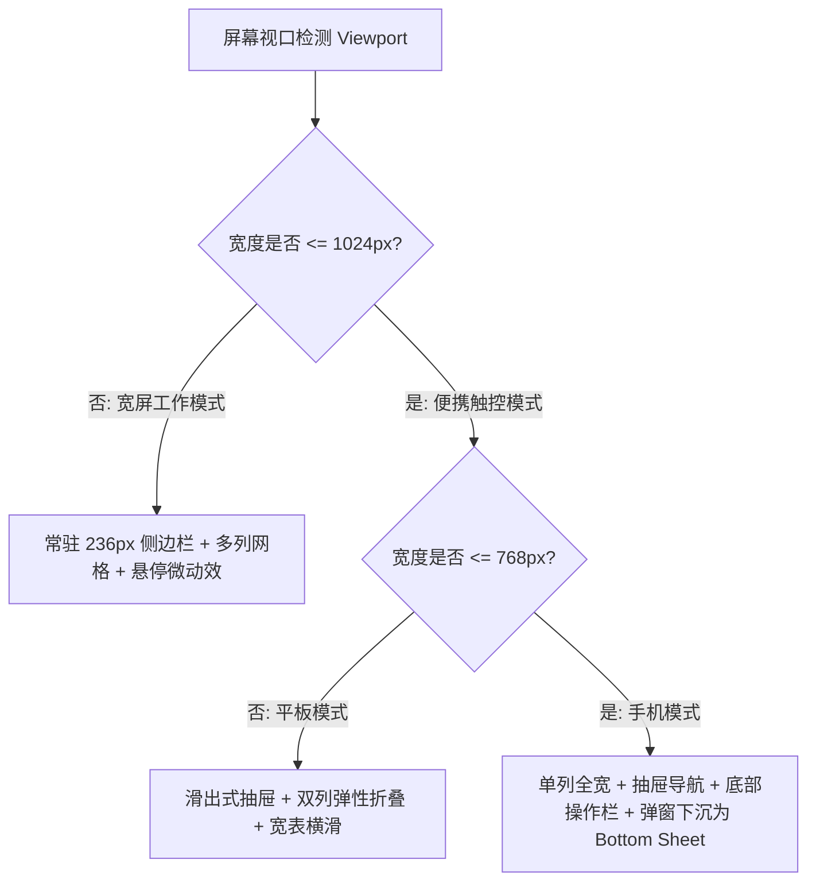

# ScienceX 全平台 UI/UX 视觉与交互体验设计规范 (Design System & UX Specification)

> **设计定位**：学术暖纸质感 × 现代极简数字工作台（Nature Journal Style × Modern Ergonomic Workspace）  
> **设计目标**：告别千篇一律的廉价 AI 蓝紫渐变，营造兼具**顶刊权威严谨度**与**次世代 AI 原生生产力**的高端科研工作流。全设备自适应响应，确保桌面端深层多屏生产力与移动端指尖微读写的极致体验。

---

## 目录 (Table of Contents)
- [一、设计哲学与品牌视觉语言 (Design Philosophy & Brand Identity)](#一设计哲学与品牌视觉语言)
- [二、色彩体系与高对比度设计规范 (Color Palette & Dark/Warm Logic)](#二色彩体系与高对比度设计规范)
- [三、学术级字体排印体系 (Scholarly Typography System)](#三学术级字体排印体系)
- [四、响应式网格与流式断点排版 (Responsive Grid & Layout Architecture)](#四响应式网格与流式断点排版)
- [五、组件卡片与材质高程系统 (Card Components & Elevation Hierarchy)](#五组件卡片与材质高程系统)
- [六、细腻微交互与物理动效规范 (Micro-Interactions & Motion Choreography)](#六细腻微交互与物理动效规范)
- [七、移动端深度适配与人体工学交互 (Mobile Ergonomics & Touch UX)](#七移动端深度适配与人体工学交互)
- [八、核心业务场景 UI/UX 精细化优化方案 (Scenario-Specific UI/UX Deep Dive)](#八核心业务场景-uiux-精细化优化方案)
- [九、设计系统落地 Token 字典与开发走查清单 (Design Tokens & Quality Checklist)](#九设计系统落地-token-字典与开发走查清单)

---

## 一、设计哲学与品牌视觉语言

### 1.1 品牌内核：学术严谨与 AI 激情的交融
* **权威严谨 (Academic Authority)**：汲取顶级学术出版物（Nature、Science、Cell）的百年装帧美学，使用温润的象牙暖白纸底（Warm Paper）与沉敛的深墨绿（Pine Green），提供长时间无蓝光刺眼的阅读耐久度。
* **次世代原生 (AI-Native Agility)**：打破传统臃肿学术软件的刻板呆滞，融合半透磨砂玻璃（Glassmorphism）、微羽化环境光晕（Ambient Glow）、亚像素边框（Sub-pixel Borders）与流式打字物理反馈。
* **思维减负 (Cognitive Ergonomics)**：信息架构杜绝视觉过载。界面层级遵循「关键信息前置 → 辅助数据折叠 → 复杂动作抽屉化」，让科研工作者沉浸于假设推导与成果发现。

### 1.2 视觉特征三角
```
               〔 材质质感 〕
        象牙暖纸 · 哑光磨砂 · 呼吸微光
                 /        \
                /          \
               /   ScienceX \
              /    Design    \
             /                \
    〔 字体排印 〕 ---------- 〔 空间流动 〕
  经典衬线 + 现代无衬线      8pt倍数网格 + 弹性收放
```

---

## 二、色彩体系与高对比度设计规范

系统拒绝使用刺眼、容易造成视疲劳的高饱和度原色，全色板严格遵循 WCAG 2.1 AA/AAA 级无障碍可读标准（文本对比度 ≥ 4.5:1，大标题 ≥ 3:1）。

### 2.1 基础色板 (Master Foundation Palette)

| 语义名称 | 变量名 | HEX 值 | 物理含义与设计应用 |
| :--- | :--- | :--- | :--- |
| **暖纸底色** | `--bg` | `#F6F4EE` | 主背景色。模拟 120g 顶级道林纸，滤除刺眼冷光，护眼长读 |
| **层级次底** | `--bg-deep` | `#EFECE2` | 侧栏底衬、选中区域高亮底色、次级容器填充 |
| **高纯表面** | `--surface` | `#FFFFFF` | 卡片表面、弹窗底色、独立输入框，承载核心信息 |
| **主墨黑** | `--ink` | `#1F2A24` | 正文文字、大标题、强强调数据；带微量绿调的复合墨黑，远比纯黑 `#000` 柔和 |
| **次级墨色** | `--ink-2` | `#4C5A52` | 副标题、字段标签、元数据、阅读器正文 |
| **灰阶刻度** | `--muted` | `#8A948D` | 禁用文本、占位符、注释、时间戳、未激活指示点 |
| **柔和边线** | `--line` | `#E6E2D6` | 卡片外边框、网格分割线、工具栏底部描边 |
| **强调边线** | `--line-strong`| `#D5D0BF` | 悬停边框、聚焦边框、主分隔线 |

### 2.2 品牌与科研语义色 (Brand & Scientific Semantics)

```
[ 品牌墨绿群 ]
#0E4A37 (深墨绿) ─── #14624A (沉稳绿) ─── #1B7A5E (品牌主色) ─── #E3F1EA (高亮浅底) ─── #F0F7F3 (极浅呼吸底)

[ 成果点缀群 ]
#C2762B (琥珀金/主要高亮) ── #FAF0E1 (琥珀浅辉) ── #B9891E (勋章金) ── #C24A42 (警示/拒稿红) ── #3E7CA6 (蓝灰/检索信息)
```

* **品牌墨绿 (`--brand: #1B7A5E`)**：代表稳健的科研生命力与逻辑严谨，用于主行动点（CTA）、主高亮标签、活跃状态。
* **学术琥珀 (`--accent: #C2762B`)**：代表高价值洞见与成果沉淀，用于重点图表折线、高热度文献星标、VIP 专业版标识。
* **深墨绿暗核 (`--sb-bg: #182822`)**：桌面端常驻左侧栏与移动端抽屉背景，压低周边干扰，让主工作区纸面跃然纸上。

---

## 三、学术级字体排印体系

字体排印是体现 ScienceX 专业学者气质的灵魂。界面采用 **「权威衬线标题 + 高清无衬线界面 + 严谨等宽数据」** 的黄金三元组组合。

### 3.1 字体栈族 (Font Families)
1. **学术衬线字体 (Scholarly Serif)**
   * CSS 变量：`--font-serif`
   * 字体栈：`"Newsreader", "Lora", "Noto Serif SC", "Source Han Serif SC", "Georgia", serif`
   * 应用场景：Logo 品牌字、H1~H2 页面主标题、论文题目展示、重点引文、数据成果数字。
2. **现代界面无衬线字体 (System Clean Sans)**
   * CSS 变量：`--font-sans`
   * 字体栈：`-apple-system, BlinkMacSystemFont, "Segoe UI", "PingFang SC", "Hiragino Sans GB", "Microsoft YaHei", sans-serif`
   * 应用场景：按钮文字、正文段落、表单输入、提示信息、侧边导航。
3. **高密度等宽代码字体 (Technical Monospace)**
   * CSS 变量：`--font-mono`
   * 字体栈：`"JetBrains Mono", "SF Mono", "Cascadia Code", Consolas, monospace`
   * 应用场景：Token 计数、GPU 温度/显存数值、超参数配置、代码块、文献 DOI 标识。

### 3.2 字阶与行高层级表 (Type Scale & Vertical Rhythm)

| 级别 (Level) | 字号 (Rem/Px) | 行高 (Line-Height) | 字重 (Weight) | 字间距 (Letter-Spacing) | 视觉用途 |
| :--- | :--- | :--- | :--- | :--- | :--- |
| **Display** | `2.5rem` (40px) | `1.2` | 700 (Serif) | `-0.02em` | 官网宣传页主 Hero Slogan、成果展示大数 |
| **H1** | `1.75rem` (28px)| `1.3` | 700 (Serif) | `-0.015em`| 页面核心一级大标题（如登录页标语、项目空间） |
| **H2** | `1.375rem`(22px)| `1.35`| 600 (Serif) | `-0.01em` | 模块区组标题（如工作台看板、三栏视区头部） |
| **H3 / Title**| `1.0625rem`(17px)|`1.4`| 600 (Sans) | `0.005em` | 卡片标题、模态框标题、顶栏模块名 |
| **Body Regular**|`0.90625rem`(14.5px)|`1.65`| 400 (Sans)| `0.01em` | 默认正文文本、文献摘要、AI 回复内容 |
| **Body Small** | `0.8125rem`(13px) | `1.5` | 500 (Sans) | `0.015em` | 辅助文字、表格元数据、列表二级描述 |
| **Caption/Tag**| `0.71875rem`(11.5px)|`1.3`| 600 (Sans) | `0.04em` (大写) | 徽章 Tag、状态小点文本、侧边栏组名 |

---

## 四、响应式网格与流式断点排版

系统建立在严格的 **8pt 栅格原子系统（8-Point Grid System）** 之上。间距阶梯定义为：  
`4px (0.5x)` · `8px (1x)` · `12px (1.5x)` · `16px (2x)` · `24px (3x)` · `32px (4x)` · `48px (6x)` · `64px (8x)`。

### 4.1 四级响应式断点标准 (Responsive Breakpoints)

```
[ 超宽桌面 Ultra-Wide ]  ≥ 1440px    : 最大内容限宽 1460px，居中微弱留白，多栏并行
[ 标配桌面 Desktop ]     1025px - 1439px: 常驻深色侧边栏 (236px)，主区双栏/三栏自由伸缩
[ 平板横向/窄屏 Tablet]  769px - 1024px : 侧边栏自动退化为汉堡滑动画布 (Drawer)，三栏降为双栏
[ 移动指尖 Mobile ]      ≤ 768px       : 单栏贯通，卡片全宽吸边，底部安全区交互，手势优先
```



### 4.2 核心布局形变规则 (Layout Morphing Strategy)
1. **三栏阅读器 (Reader) 适配**：
   * 桌面端（≥1200px）：`220px 文献目录` + `1fr 核心正文/导图` + `380px AI 研读助理` 并列呈现。
   * 平板端（769px - 1199px）：文献目录收拢为顶栏下拉选择，中间保留双栏分屏。
   * 移动端（≤768px）：变为**滑动分段标签页（Segmented Tabs）**，用户可在「文献正文」、「思维导图」、「AI 问答」三屏之间一键无缝滑动切换。
2. **宽幅数据表格 (Wide Tables) 适配**：
   * 采用 `.table-responsive` 容器包裹。
   * 激活 `.table-sticky-col`：表格首列（如指标名称、模型名称）向左吸附锁定，右侧区域平滑滚动，并伴随柔和的右侧边缘半透投影，杜绝移动端横向破裂。

---

## 五、组件卡片与材质高程系统

### 5.1 复合材质卡片 (The ScienceX Card Architecture)
ScienceX 的卡片摒弃厚重死板的边框，使用**温润纸面表面 + 细边框 + 微环境阴影**的物理层次感。

```
┌────────────────────────────────────────────────────────┐
│  [卡片头部] 图标 + 衬线小标题             [胶囊标签 Tag]  │
│  border-bottom: 1px solid var(--line)                   │
├────────────────────────────────────────────────────────┤
│  [核心展示区] 进度条 / 数据图表 / 等宽数值                 │
│  padding: 18px 20px                                    │
├────────────────────────────────────────────────────────┤
│  [操作底栏] 辅助元数据 · 时间戳           [操作按钮动作区]│
│  margin-top: auto; border-top: 1px dashed var(--line)  │
└────────────────────────────────────────────────────────┘
```

### 5.2 材质与投影高程阶梯 (Elevation & Shadow Tokens)

* **Level 0 (Flat)**：`background: var(--bg)`，无投影。底层画卷。
* **Level 1 (Card Standard)**：
  ```css
  background: var(--surface);
  border: 1px solid var(--line);
  border-radius: var(--r-lg); /* 16px */
  box-shadow: 0 1px 2px rgba(31, 42, 36, 0.04), 0 4px 16px -8px rgba(31, 42, 36, 0.08);
  ```
* **Level 2 (Hover & Active)**：
  ```css
  transform: translateY(-2px);
  border-color: var(--line-strong);
  box-shadow: 0 4px 12px rgba(31, 42, 36, 0.06), 0 12px 28px -10px rgba(31, 42, 36, 0.16);
  ```
* **Level 3 (Floating Popover / Modal)**：
  ```css
  background: rgba(255, 255, 255, 0.94);
  backdrop-filter: blur(16px);
  border: 1px solid rgba(255, 255, 255, 0.6);
  box-shadow: 0 12px 36px -8px rgba(20, 28, 24, 0.22);
  ```

### 5.3 交互状态四态体系 (States Checklist)
每个业务展示容器均强制提供规范化的「四态呈现」，消除用户在弱网或空数据时的迷失感：
1. **正常态 (Normal)**：完整数据图文排布，操作点处于自然明度。
2. **加载态 (Loading)**：
   * 骨架屏（Skeleton Shimmer）：模拟真实文本的 3~4 条渐变扫光骨架，扫光周期 1.5s。
   * 微脉冲点（Pulse Indicator）：用于 AI 正在思考时的行内波浪点动效。
3. **空状态 (Empty)**：居中 48px 学术图标（如带有羽化背景的软质天平/书籍）+ 14px 引导语 + 清晰的「立即创建/导入」主按钮。
4. **错误/重试态 (Error)**：柔红背景卡片（`var(--red-soft)`）+ 故障明确说明 + 醒目的「重试 (Retry)」交互。

---

## 六、细腻微交互与物理动效规范

界面动效的目标是**辅助空间感知与认知反馈**，严禁出现延迟拖沓、无意义的晃动炫技。

### 6.1 运动物理曲线与时长 (Motion Timing & Curves)

```css
:root {
  /* 标准平滑减速曲线：符合自然物理惯性，启动快，入位极柔和 */
  --ease-scholarly: cubic-bezier(0.22, 0.8, 0.32, 1);
  
  /* 弹性回弹曲线：用于小徽章弹出、点赞/关注收藏激活 */
  --ease-spring: cubic-bezier(0.34, 1.56, 0.64, 1);

  --t-micro: 0.12s;  /* 按钮按下、颜色轻变、简单悬停 */
  --t-fast:  0.22s;  /* 下拉菜单展开、卡片悬浮上升、Tab 切换 */
  --t-mid:   0.36s;  /* 模态框浮现、侧边栏滑出抽屉、大面板折叠 */
  --t-slow:  0.60s;  /* 页面转场骨架、图表动态绘制曲线 */
}
```

### 6.2 核心微动效细则

1. **按钮磁吸与微触感 (Micro Button Feedback)**：
   * 悬停（Hover）：`transform: translateY(-1px); filter: brightness(1.03);`
   * 按下（Active/Tap）：`transform: scale(0.97); filter: brightness(0.96);` 触控瞬时回缩，模拟物理微动开关。
2. **渐进交错入场 (Staggered Children Entrance)**：
   * 列表项（如历史会话、文献列表、成果卡片）进入视口时，子元素应用 `animation: fadeUp 0.4s var(--ease-scholarly) both;`。
   * 自动附加 `animation-delay: calc(var(--index) * 45ms)`，形成如行云流水般的瀑布式次序渲染。
3. **AI 生成打字机光标 (Blink Caret & Dot Wave)**：
   * 流式生成进行时，尾部跟随 `▍` 矩形光标（`animation: blink 0.85s infinite; color: var(--brand)`）。
   * 等待首字返回时，展示三个带阶梯延迟的墨绿小圆点，上下交替波浪浮动（`@keyframes wave`）。
4. **无障碍动效降级 (Prefers-Reduced-Motion)**：
   ```css
   @media (prefers-reduced-motion: reduce) {
     *, *::before, *::after {
       animation-duration: 0.01ms !important;
       animation-iteration-count: 1 !important;
       transition-duration: 0.01ms !important;
     }
   }
   ```

---

## 七、移动端深度适配与人体工学交互

在智能手机与平板触控设备上，交互逻辑从「鼠标悬停 + 滚轮」切换为「拇指热区 + 惯性滑动手势」。

### 7.1 拇指黄金操控热区 (Thumb Zone Ergonomics)

```
┌─────────────────────────────────┐ ── 状态栏 & 顶部导航
│ [Logo]             [搜索] [头像] │ 弱点击区 (仅用于全局状态查看)
├─────────────────────────────────┤
│                                 │
│                                 │
│        舒适视读区 (Natural)       │ 浏览核心学术成果 / 图表 / 对话
│                                 │
│                                 │
├─────────────────────────────────┤
│    拇指易达操控区 (Easy Reach)    │
│  [输入框 / 快捷指令胶囊 / 语音录入]│
├─────────────────────────────────┤
│  [ 对话 ] [ 文献 ] [ 实验 ] [ 我 ] │ ── 底部固定操作槽 (Bottom App Bar)
└─────────────────────────────────┘ ── iOS Home Indicator (安全内边距 34px)
```

### 7.2 移动端专有优化动作规范
1. **触控目标尺寸底线 (Touch Target Sizing)**：
   * 所有可交互按钮、图标热区尺寸必须 **≥ 44px × 44px**（即使图标视觉本身只有 16px，使用 `padding` 或透明外延补齐）。
   * 连续并排的标签或操作按钮，横向间距不低于 `8px`，防止误触。
2. **模态弹窗下沉为 Bottom Sheet**：
   * 移动端（`max-width: 768px`）禁止使用屏幕居中的传统 PC Modal。
   * 统一自动转换为**底部升起滑板（Bottom Sheet）**：顶部带有圆润推拉手柄（Drag Handle），圆角统一为 `18px 18px 0 0`，自底向上滑出，支持向下滑动轻松关闭。
3. **软键盘自适应与防止视口错位**：
   * 对话输入框与写作编辑器采用 `100dvh`（Dynamic Viewport Height）动态计算视口高度。
   * 在 iOS Safari 上将输入框字体设定为 **≥ 16px**，坚决杜绝聚焦时页面被系统强制放大失真的恶性体验。
4. **宽矩阵与图表横滑卡片吸附 (Scroll Snap)**：
   * 移动端展示实验对比矩阵或多模型评测雷达图时，开启 CSS `scroll-snap-type: x mandatory`。
   * 单个卡片宽度设置为 `calc(100vw - 48px)`，边缘预留下张卡片微露诱导，滑动手势顺滑吸附停顿。

---

## 八、核心业务场景 UI/UX 精细化优化方案

### 8.1 官网宣传页 (Landing Page)
* **视觉痛点**：过去官网卡片背景多有突兀白块，移动端缺乏节奏感。
* **重构方案**：
  1. **Hero 区域**：左侧为学术衬线排版标语 + 双主色发光渐变胶囊；右侧呈现 3D 浮动科研工作台微缩视差卡片，微倾斜 4° 营造立体纵深。
  2. **跑马灯机构背书 (Marquee)**：无缝无限循环滚动顶尖高校与实验室徽标，两端增加 `linear-gradient` 半透蒙版羽化边缘。
  3. **竞品对比 (Compare Matrix)**：彻底消除白色表面，采用深色与半透卡片并置，绿勾加亮、灰色标叉，关键指标用琥珀金打亮。
  4. **底部极致 CTA**：极简化为「准备好让 AI 成为你的终身科研协同伴侣了吗？」，提供醒目的「立即开启科研之旅 · 免费使用」高亮按钮，移动端吸底浮现。

### 8.2 AI 对话工作台 (Chat & HUD Dashboard)
* **视觉痛点**：传统 AI 对话界面过于单薄，缺少科研项目上下文沉淀。
* **重构方案**：
  1. **顶部状态带**：一目了然展示当前使用的模型（如 `GPT-4o 在线`）、今日 Token 消耗量与微型成本计数器。
  2. **会话侧栏**：提供即时过滤搜索框，活跃会话应用淡墨绿胶囊微压底；悬停才浮现重命名与删除按钮，保持界面安静。
  3. **置底科研进度仪表盘 (Research HUD)**：
     * **微表情（MER）研究总进度**：四阶段（选题 100%、文献 78%、实验 55%、分析 40%）配比不同梯度进度的琥珀/墨绿进度条。
     * **最近产出快速直达**：消融图表、七段式总结、PPT 汇报稿支持一键跳转编辑。
     * **今日文献速递**：算法根据当前课题自动推送 arXiv 热门文献，附带匹配星级与一键阅读。

### 8.3 文献三栏联动阅读器 (Reader)
* **视觉痛点**：文献阅读信息密度极高，多重视角易打乱心流。
* **重构方案**：
  1. **左栏（文献抽屉）**：缩略展示年份、刊物级别（如 `CCF-A`、`IF 18.2`）与解析状态，已解析呈现优雅实心小绿点。
  2. **中栏（沉浸解析区）**：
     * 论文段落鼠标悬停即浮现行内「翻译 / 释义 / 质疑」微悬浮钮。
     * 顶部 Tab 提供「思维导图（交互树）」与「引用图谱（引文星系关系图）」平滑切换，图表支持手势缩放拖拽。
  3. **右栏（专属文献 Agent）**：每一句 AI 回答均严格标注引用源页码与对应章节锚点（如 `[p.4 §3.2]`），点击即刻驱动中栏正文平滑滚动并高亮对应句子。

### 8.4 实验设计与算力监控 (Experiment & GPU Nodes)
* **视觉痛点**：数字过密，缺少状态层级，实验进展缺乏直观反馈。
* **重构方案**：
  1. **GPU 节点状态网格**：
     * 仿工业监控仪表盘，显存利用率使用环形刻度进度圈（Gauge）。
     * 温度指标设置智能色温：<65°C 为安全静谧绿，65°C~80°C 为学术琥珀橙，>80°C 自动呼吸警示红闪。
  2. **SOTA 基线跑分对标**：
     * 使用横向双色条对比：基线标准（浅灰底） vs 本项目突破得分（墨绿加粗），并在溢出区间使用带数字角标的箭头标识增量（如 `+2.8% ↑`）。

### 8.5 专家同行评审团 (Multi-Agent Peer Review)
* **视觉痛点**：五位专家的评价维度各异，纯文本阅读效率低。
* **重构方案**：
  1. **专家辩论雷达 (Debate Radar)**：顶部直观呈现理论严谨度、方法新颖度、实验充分度、学术写作与科研伦理五维雷达图。
  2. **角色人设卡片 (Persona Cards)**：
     * 审稿人 1 (理论派/严苛)、审稿人 2 (工业落地/实用)、审稿人 3 (统计学狂魔) 分别配备专属色系边框与评判态度徽章（`Strong Accept` / `Major Revision`）。
  3. **分歧冲突看板 (Conflict Matrix)**：智能提取多位审稿人意见相左的核心争议点，提供折叠对比与逐条答复待办清单（Action Checklist）。

---

## 九、设计系统落地 Token 字典与开发走查清单

### 9.1 CSS 自定义属性落地速查 (Core Tokens)

```css
/* 设计系统核心语义变量 (Design Tokens) */
:root {
  /* 基础底色 */
  --bg: #F6F4EE;
  --bg-deep: #EFECE2;
  --surface: #FFFFFF;
  --ink: #1F2A24;
  --ink-2: #4C5A52;
  --muted: #8A948D;
  --line: #E6E2D6;
  --line-strong: #D5D0BF;

  /* 品牌色阶 */
  --brand: #1B7A5E;
  --brand-strong: #14624A;
  --brand-deep: #0E4A37;
  --brand-soft: #E3F1EA;
  --brand-softer: #F0F7F3;

  /* 辅助/强调 */
  --accent: #C2762B;
  --accent-soft: #FAF0E1;
  --gold: #B9891E;
  --red: #C24A42;
  --red-soft: #F9ECEA;
  --blue-safe: #3E7CA6;

  /* 深色容器专用（侧边栏/移动抽屉） */
  --sb-bg: #182822;
  --sb-bg-2: #122019;
  --sb-text: #A9BCB2;
  --sb-text-dim: #71857B;
  --sb-active-bg: #26443A;

  /* 圆角 */
  --r-sm: 8px;
  --r-md: 12px;
  --r-lg: 16px;
  --r-xl: 20px;
  --r-full: 9999px;

  /* 投影 */
  --shadow-sm: 0 1px 2px rgba(31, 42, 36, 0.05);
  --shadow-md: 0 4px 16px -4px rgba(31, 42, 36, 0.10);
  --shadow-lg: 0 12px 32px -8px rgba(31, 42, 36, 0.16);

  /* 动效 */
  --ease: cubic-bezier(0.22, 0.8, 0.32, 1);
  --t-fast: 0.16s;
  --t-mid: 0.28s;
}
```

### 9.2 UI/UX 视觉与交互走查清单 (Design QA Checklist)

#### 视觉呈现 (Visual Consistency)
- [ ] **色彩统一性**：所有卡片、边框、文字均引用 CSS 变量，严禁代码中散落写死的 `#ffffff` 或任意未经校准的 Hex 色值。
- [ ] **纸面质感**：主工作区必须保持象牙暖白纸底（`#f6f4ee`），不得出现大面积纯白刺眼无层次布局。
- [ ] **字体层级**：所有模块主标题均规范使用 Serif 字体，正文及交互文字采用无衬线系统字体，数值与代码使用等宽字体。
- [ ] **对比度验证**：小号辅助文字在浅底上的对比度必须达到 4.5:1，重要操作按钮对比度必须达到 7:1。

#### 交互体验 (Interaction Experience)
- [ ] **悬停与点击反馈**：所有按钮、卡片、列表项在 Hover、Focus、Active 状态均有平滑且明确的物理形变或明度过渡。
- [ ] **四态完备性**：所有异步拉取模块必须具备 Loading（骨架屏/指示器）、Empty（空数据引导）、Error（友好重试）完整状态。
- [ ] **长列表性能**：超过 50 项的用量列表与项目资产库均已接入 `VirtualList` 虚拟滚动，滚动帧率稳定在 60fps。

#### 移动端适配 (Mobile Ergonomics)
- [ ] **触控舒适度**：移动端所有独立按钮与交互图标尺寸均达到 44×44px 触控标准，避免误触。
- [ ] **无水平横向溢出**：在 320px~480px 手机视口下，页面整体不出现未预期的横向滚动条，宽表格必须由 `.table-responsive` 容器包裹。
- [ ] **模态弹窗下沉**：手机屏幕下的居中弹窗全部下沉为底部抽屉板（Bottom Sheet），并留出底部安全区（`safe-area-inset-bottom`）。
- [ ] **软键盘聚焦**：输入框聚焦激活软键盘时，页面视口不发生错位形变，发送按钮依然可轻松点触。

---

*本设计规范由 ScienceX 核心产品设计团队制定，作为后续全站页面重构、组件复用、移动端适配与新功能迭代的统一遵循标准。*
