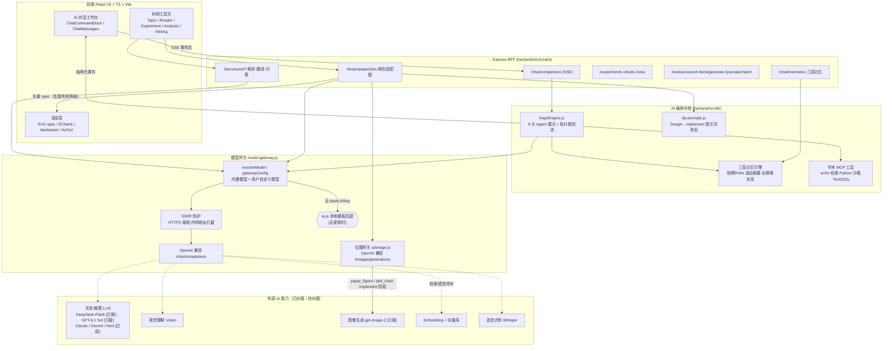

# ScienceX 项目 AI 能力全景分析

> 本文档基于对 ScienceX 科研 AI 工作台代码库（`backend/src/lib`、`backend/src/routes`、`frontend/src/pages`）与设计文档（`PRD.md`、`TSD.md`、`docs/对接.md`、`docs/DREAMPAPER_INTEGRATION.md`）的全面分析生成，用于指导后续真实 AI 能力的对接落地。
>
> **重要说明**：当前项目为**全栈离线演示（Demo）+ 部分真实网关对接**。文本对话 / 翻译 / 结构化输出由本地模板或确定性回退模拟（见 `backend/src/lib/ai.js`、`backend/src/lib/agents/lingxiEngine.js`）；**已真实对接**的能力包括：① DeepSeek V4.1 Flash 文本网关（Sophnet）；② OpenAI Next 统一文本网关（GPT-6.1 Sol / Claude Sonnet 5 / Gemini 3.8 Flash 等，`OPENAINEXT_*` 配置）；③ **gpt-image-2 生图网关**（`backend/src/ai/image.js`，`IMAGE_*` 配置，科研图位图渲染，见 `backend/src/routes/dreampaper.js`）。模型路由统一走 `backend/src/lib/model-gateway.js`。本文档的「推荐模型」与「调用价格」为**生产对接规划参考**，价格为 2025 年公开牌价示意，**接入前务必以各厂商官方定价页为准**。

---

## 一、项目定位与 AI 能力总览

ScienceX 是覆盖 **选题 → 文献 → 实验 → 分析 → 写作 → 投稿 → 组会 / 评审** 全生命周期的 AI 科研工作台。其 AI 能力可归纳为「理解 → 检索 → 分析 → 生成 → 校验 → 协作」六段式全链路。

| 业务环节 | 承载模块（前端 / 后端路由） | 核心 AI 能力 | 当前实现状态 |
| :--- | :--- | :--- | :--- |
| 对话中枢 | `Chat.tsx` / `routes/chat.js` + `agents/lingxiEngine.js` | 8 类 Agent 编排、多轮记忆、工具调用、流式输出 | 演示模拟 + 可选网关（默认模型 GPT-6.1 Sol） |
| 选题灵感 | `Topic.tsx` / `routes/literature.js` | 多源检索、综述生成、选题推荐、可行性评估 | 演示模拟 |
| 文献阅读 | `Reader.tsx` / `routes/documents.js` | 版面解析、翻译、思维导图、七段总结、引用图谱、RAG 问答 | 演示 + 网关翻译/问答 |
| 实验设计 | `Experiment.tsx` / `routes/research.js` | 方案生成、SOTA 对标、参数看板 | 演示模拟 |
| 数据分析 / 科研图 | `Analysis.tsx` / `routes/dreampaper.js` | 两阶段 Design→Implement 配图、图表 spec 渲染 | **生图网关（gpt-image-2 真实位图）+ 矢量回退** |
| 论文写作 | `Writing.tsx` / `routes/documents.js` | 中英互译、学术润色、AI 查重、AI 降重 | 演示 + 网关 |
| 投稿助手 | `Submission.tsx` / `routes/publish.js` | 期刊匹配推荐、CCF 查询、倒计时 | 规则 + 演示 |
| 组会汇报 | `Meeting.tsx` / `routes/publish.js` | PPT 大纲生成、导师建议结构化（ASR+LLM） | 演示模拟 |
| 专家评审团 | `Review.tsx` / `routes/publish.js` | 多智能体（理论/方法/实验/写作/伦理）并行评审 + 主席汇总 | 演示模拟 |
| 知识管理 | `Projects.tsx` / `routes/documents.js` | RAG 知识库、语义检索、溯源问答 | 演示模拟 |

---

## 二、AI 能力全景架构图

### 2.1 运行时调用链（当前真实代码结构）



### 2.2 分层架构（目标生产态）

| 层级 | 组件 | 技术选型 |
| :--- | :--- | :--- |
| 前端层 | 主框架 / 阅读器 / 图表 | React 18 + TS + Vite、PDF.js、ECharts + D3/Cytoscape |
| 接入层 | API 网关 / BFF | Nginx + Spring Cloud Gateway / Node BFF（鉴权、限流、路由） |
| 后端层 | 业务主服务 / AI 服务 | Java（Spring Boot 3）业务 + Python（FastAPI）AI（目标态） |
| AI/模型层 | 模型网关 / Agent 编排 / RAG / MCP | OpenAI 兼容 + LiteLLM 路由、LangChain/LlamaIndex、Embedding+向量库+Rerank、Skill Registry+MCP Client |
| 数据层 | 关系/向量/缓存/搜索/对象/时序 | PostgreSQL、pgvector/Milvus、Redis、Elasticsearch、S3/MinIO、Prometheus |
| 基础设施 | 部署 / CI / 监控 / 安全 | Docker+K8s、GitHub Actions、Prometheus+Grafana+Sentry、OAuth2/JWT+KMS |

### 2.3 关键运行时机制（源码级）

1. **模型网关与优雅降级**（`ai.js` / `model-gateway.js`）：`generateResponse()` 优先调用已配置的 OpenAI 兼容网关；无密钥或调用失败时回退到 `generateReply()` 本地模板，保证 Demo 永不空转。自定义模型强制 **HTTPS + 内网/环回地址拦截（SSRF 防护）**。
2. **SSE 结构化事件协议**（`lingxiEngine.executeAgentStream`）：事件类型 `start / memory_injected / plan / step_start / step_update / thought / tool_call / tool_result / delta / done / error`，前端按事件类型分别驱动规划看板、思维链、工具卡片与打字机正文。
3. **8 大 Agent 编排模式**：`general / react / plan_execute / codeact / mcp / skill / text2sql / structured`，每种模式对应独立推理管线与输出形态。
4. **课题组三层记忆**：第一层会话内存、第二层滚动摘要、第三层长期事实库（按 `user_id`/`project_id` 隔离），注入到提示词上下文。
5. **DreamPaper 两阶段流水线**：阶段一抽取模板结构 / 母版风格（structure/analyzer），阶段二按用户内容填充产出可渲染 JSON spec（design/implement），配合 **stage-weight 进度映射** 与 **Design Log** 流式推送；Implement 阶段**优先调用生图网关**产出真实位图，未配置或失败时降级为前端 **矢量 SVG spec 渲染**。
6. **生图网关**（`backend/src/ai/image.js`，**已对接生效**）：OpenAI 兼容 `POST /v1/images/generations`，默认模型 **gpt-image-2**（`IMAGE_BASE_URL / IMAGE_API_KEY / IMAGE_MODEL / IMAGE_TIMEOUT_MS` 配置，超时 180s，单图耗时约 60–70s）。支持 `size` 映射（16:9/3:2/4:3 → 1536x1024，1:1 → 1024x1024），返回 CDN 直链 `url` 与 `b64_json` 双通道（直链优先展示，base64 兜底转 data URL，任务列表接口剥离大体积 base64）。生图失败不中断任务——写入 `render_warning` 并降级矢量渲染。

---

## 三、需要对接的 AI 能力需求（按模态分类）

> 价格为 **2025 年公开牌价示意**（多为「每百万 tokens，输入/输出，USD」），仅用于成本规划，**接入前以官方定价为准**。`¥` 估算按 1 USD ≈ 7.2 CNY。

### 3.1 按模态分类的 AI 能力 × 推荐模型 × 价格总表

> 按 **文本 / 图片（视觉）/ 语音 / 视频** 四大模态拆分为独立表格。「当前实现」指本演示仓库现状；**视频模态 ScienceX 目前尚未涉及**，作为 AI 能力全景的规划补充。价格为 2025 公开牌价示意，接入前以官方为准。

#### 3.1.1 文本模态（Text）

| 能力点（ScienceX 场景） | 当前实现 | 推荐对接模型（主 / 备） | 参考调用价格（每百万 token，入/出） | 优先级 |
| :--- | :--- | :--- | :--- | :--- |
| **生成 / 推理**：对话中枢、综述大纲、选题推荐、可行性评估、润色、降重、审稿意见 | **已对接生效（DeepSeek V4.1 Flash，见 `backend/src/ai/`）** + 本地回退 | **DeepSeek V4.1 Flash (`DeepSeek-Flash`) [已实装]** / GPT-4o / Claude 3.7 Sonnet | DeepSeek-Flash 极速低价；GPT-4o ≈ \$2.5/\$10；Claude 3.7 ≈ \$3/\$15 | P0 |
| **长上下文 / RAG 问答**：论文全文问答、知识库溯源、多人讨论 | **已对接生效（DeepSeek V4.1 Flash，见 `backend/src/ai/`）** | **DeepSeek-Flash [已实装]** / Claude 3.7 / Gemini 2.0 / GPT-4o | 同上；配 RAG 检索可显著降 input token | P0 |
| **Embedding 向量化**：文献去重、知识库检索、查重相似度、期刊匹配 | 规则 / 演示 | text-embedding-3-small / -large / bge-m3（自建） | 3-small ≈ \$0.02；3-large ≈ \$0.13；bge 自建免费 | P0 |
| **Rerank 重排序**：检索结果相关性精排 | 无（预留） | Cohere Rerank / bge-reranker-v2（自建） | Cohere ≈ \$2.0/1000 次查询；自建免费 | P1 |
| **代码生成与执行（CodeAct）**：消融数据分析、绘图脚本沙箱 | 内置伪执行器（返回固定图） | 代码 LLM（DeepSeek-Coder / GPT-4o）+ 受控 Python 沙箱（Docker/Firecracker） | 代码生成按 LLM token；沙箱仅算力 | P1 |
| **结构化输出 / Function Calling**：JSON spec、Text2SQL、LaTeX 三线表、审稿矩阵 | **已对接生效（DeepSeek V4.1 Flash，见 `backend/src/ai/`）** | **DeepSeek-Flash [已实装]** / GPT-4o / Claude | 同 LLM 价；建议 temperature 0–0.2 | P0 |
| **多智能体编排**：专家评审团（5 角色）、Plan-Execute 规划流 | lingxiEngine 调度 + DeepSeek 驱动 | **DeepSeek-Flash [已实装]** + 编排引擎 (LingXi) | ≈ N 个 Agent × 单 Agent token | P1 |
| **翻译**：段落级中英互译、术语对齐 | **已对接生效（DeepSeek V4.1 Flash，见 `backend/src/ai/`）** | **DeepSeek-Flash [已实装]** / GPT-4o mini / Gemini Flash | 极低成本，支持保留公式与引用 | P0 |
| **提示词增强**：一键优化用户 prompt | **已对接生效（DeepSeek V4.1 Flash，见 `backend/src/ai/`）** | **DeepSeek-Flash [已实装]**（`/api/v1/prompt/enhance`） | 毫秒级极速响应 | P1 |

#### 3.1.2 图片模态（视觉 / Vision）

| 能力点（ScienceX 场景） | 当前实现 | 推荐对接模型（主 / 备） | 参考调用价格 | 优先级 |
| :--- | :--- | :--- | :--- | :--- |
| **视觉理解**：图表解读、上传图像分析、公式/版面识别辅助 | 无（预留） | GPT-4o Vision / Gemini 2.0 Flash / Claude 3.7 Vision | 图像折算 token，约 \$2.5–\$3/百万 input；单图 ≈ \$0.003–0.01 | P1 |
| **图像生成（image2）**：科研配图栅格渲染、封面/示意图 | **已对接生效（gpt-image-2 · OpenAI Next 生图网关 `ai/image.js`，DreamPaper Implement 阶段真实位图 + 前端 PNG 导出；失败降级矢量 SVG）** | **gpt-image-2 [已实装]** / gpt-image-1 / DALL·E 3 / Stable Diffusion XL（自建）/ Ideogram | gpt-image-2 实测约 60–70s/图；gpt-image-1 ≈ \$0.02–0.19/图；DALL·E 3 ≈ \$0.04/图（HD \$0.08）；自建仅算力 | P1 |
| **文档版面解析**：PDF 两栏解析、公式/图表抽取、结构化正文 | 模拟任务流 | MinerU / GROBID / Nougat（自建）+ 商用 PDF 解析 API | 自建：算力；商用 ≈ \$0.01–0.05/页 | P0 |
| **OCR 文字识别**：扫描件 / 图片中文字与公式提取 | 无（预留） | PaddleOCR（自建）/ Azure Read / GPT-4o Vision | 自建免费；云 OCR ≈ \$1/千页 | P2 |

#### 3.1.3 语音模态（Audio）

| 能力点（ScienceX 场景） | 当前实现 | 推荐对接模型（主 / 备） | 参考调用价格 | 优先级 |
| :--- | :--- | :--- | :--- | :--- |
| **语音识别（ASR）**：语音输入转写、组会导师建议录音结构化 | Web Speech 模拟 | OpenAI Whisper / 阿里云 ASR / 讯飞 | Whisper ≈ \$0.006/分钟；Web Speech API 免费（浏览器侧） | P1 |
| **说话人分离**：组会多人对话区分发言人 | 无（预留） | Whisper + pyannote / 阿里云录音识别 | ≈ ASR 价 + 分离算力 | P2 |
| **语音合成（TTS）**：论文朗读、汇报播报、无障碍 | 无（预留） | OpenAI TTS / Azure TTS / Edge TTS | OpenAI TTS ≈ \$15/百万字符；Edge TTS 免费 | P2 |

#### 3.1.4 视频模态（Video）

> ScienceX 当前未涉及视频能力，作为 AI 能力全景的规划补充（面向实验录屏分析、组会纪要、成果演示等场景）。

| 能力点（ScienceX 场景） | 当前实现 | 推荐对接模型（主 / 备） | 参考调用价格 | 优先级 |
| :--- | :--- | :--- | :--- | :--- |
| **视频理解**：实验录屏分析、组会录像自动摘要、图表动画解读 | 无（未涉及） | Gemini 2.0（原生视频输入）/ GPT-4o 抽帧 + VLM | Gemini 视频按 token（≈258 token/秒）计入 input 价；抽帧方案按图像计费 | P2 |
| **视频生成**：成果演示动画、方法流程讲解视频 | 无（未涉及） | Veo 3 / Runway Gen-4 / 可灵 Kling / Sora | Veo 3 ≈ \$0.15–0.40/秒；Runway / 可灵按积分或订阅 | P2 |
| **数字人讲解**：论文口头报告、组会汇报口播 | 无（未涉及） | HeyGen / Synthesia + TTS | 订阅制为主（≈\$24–99/月起）+ TTS 成本 | P2 |

### 3.2 内置可选模型清单（`store.builtinModels`）

| 模型 ID | 名称 | 网关 / 厂商 | 定位标签 | 上下文 | 状态 |
| :--- | :--- | :--- | :--- | :--- | :--- |
| m-deepseek-flash | DeepSeek V4.1 Flash | Sophnet (`DEEPSEEK_*`) | 极速推理 · 默认推荐 | 64K | 已实测连通 |
| m-gpt-sol | GPT-6.1 Sol | OpenAI Next (`OPENAINEXT_*`) | 通用旗舰 · 深度推理 · **工作台默认选中** | 128K | 已实测连通 |
| m-claude | Claude Sonnet 5 | OpenAI Next (`OPENAINEXT_*`) | 长文写作 · 学术润色 | 200K | 已实测连通 |
| m-gemini | Gemini 3.8 Flash | OpenAI Next (`OPENAINEXT_*`) | 高速低价 · 超长上下文 | 1M | 已实测连通 |
| m-deepseek | DeepSeek V4 Pro | OpenAI Next (`OPENAINEXT_*`) | 代码 / 数学推理 | 128K | 已实测连通 |
| m-kimi | Kimi K2.5 | OpenAI Next (`OPENAINEXT_*`) | 中文长文档精读 | 256K | 已实测连通 |

> OpenAI Next 网关（`https://api.openai-next.com/v1`）为 OpenAI 兼容协议，同一套 SDK 路由多厂商模型，便于按成本/质量切换；文本超时 60–90s。**生图**独立走 `ai/image.js` 网关（同站 `/v1/images/generations`，模型 `gpt-image-2`，`IMAGE_*` 配置）。
>
> 另支持用户自定义 OpenAI 兼容模型（`store.customModels`，如 `lab-local-qwen2.5-72b`），配置 `base_url + model_name + api_key`（密钥加密存储，HTTPS + 内网拦截）。

### 3.3 成本估算示例（单次典型请求）

| 场景 | 估算 token | 推荐模型 | 单次成本（USD 示意） |
| :--- | :--- | :--- | :--- |
| 一轮通用对话（含记忆注入） | 入 2K / 出 1K | GPT-4o | ≈ \$0.015 |
| 论文七段总结（长文） | 入 15K / 出 2K | Claude 3.7 | ≈ \$0.075 |
| 综述草稿生成（RAG+长文） | 入 30K / 出 6K | Gemini 2.0 Flash | ≈ \$0.0054 |
| 科研配图 Design（JSON spec） | 入 4K / 出 2K | GPT-4o | ≈ \$0.03 |
| 图表解读（Vision） | 1 图 + 0.5K 文本 | GPT-4o Vision | ≈ \$0.01 |
| 知识库 10K 文档入库 | 10M token | embedding-3-small | ≈ \$0.20 |

---

## 四、提示词策略（表格总结）

### 4.1 全局提示词工程原则

| 策略 | 说明 | 落地位置 |
| :--- | :--- | :--- |
| **角色先行（Role Priming）** | 每个任务以「你是……助手 / 设计 Agent / 审稿人」设定身份与边界 | `dp-prompts.js GLOBAL_SYSTEM`、`/prompt/enhance`、`documents translate` |
| **结构化输出契约（Output Contract）** | 显式声明必须返回的 JSON schema，禁止 Markdown 围栏，保证可解析 | `dp-prompts.js outputContract(mode)` |
| **两阶段拆分（Design → Implement）** | 先抽结构 / 母版风格，再按用户内容填充，降低一次性幻觉 | `dp-prompts.js PAPER_STRUCTURE / DIAGRAM_DESIGN` |
| **忠实性红线（Faithfulness）** | 「用户文本是内容唯一来源，不得杜撰数据 / 指标 / 引用 / 统计标注」 | `DIAGRAM_DESIGN`、`PLOT_DESIGN` |
| **防塌缩规则（Anti-collapse）** | 富方法文本必须展开为 ≥10 模块 / ≥8 连接，避免退化为 3-4 空框 | `DIAGRAM_DESIGN` |
| **简洁性约束（Conciseness）** | 可见标签 ≤10 中文字 / ≤8 英文词，只压缩措辞不压缩步骤 | `DIAGRAM_DESIGN / PLOT_DESIGN` |
| **Few-shot 模板参考** | 模板图/意图作为版式与密度参考，**禁止像素级复制** | `PAPER_STRUCTURE`、`dpTemplates` |
| **案例记忆召回（Advisor）** | 对比历史优/差评案例，迁移版式经验、规避已知失败模式 | `ADVISOR`、`runPipeline(memory/advisor)` |
| **上下文记忆注入** | 将三层记忆（长期事实 + 滚动摘要）拼入提示词，跨会话保持科研上下文 | `buildMemoryPrompt()` |
| **质量自校验（Validator）** | 生成后用校验提示检查 JSON 合法性、方向保真、数据完整性 | `VALIDATOR` |
| **JSON 修复与降级** | 解析失败 → 正则抽取 `{...}` → 仍失败则确定性回退构造 spec | `designJSON()`、`fallbackDiagram/Plot/Deck` |
| **低温度确定性** | 网关默认 `temperature=0.2`，结构化/配图任务偏保守 | `model-gateway.complete()` |

### 4.2 各功能模块提示词模板清单（源码提炼）

| 模块 / 端点 | 提示词策略（System / 指令要点） | 期望输出 |
| :--- | :--- | :--- |
| `/chat/completions`（general） | 「结合课题组长期记忆（基线 up9 / LOSO 协议 / 3 种子纪律）」+ 记忆注入段 | Markdown 建议正文 |
| `/chat/completions`（plan_execute） | 4 步任务拆解（检索→比对→沙箱校验→合成报告），每步带 tool 与状态机 | 规划流事件 + 汇总报告（含 LaTeX 表） |
| `/chat/completions`（react） | 强制 Thought → Action → Observation 三轮链式推演 | 推演过程 + 严谨论证报告 |
| `/chat/completions`（codeact） | 生成受控 Python（numpy/matplotlib/seaborn）绘图脚本并沙箱执行 | 代码 + chart_data + stdout |
| `/chat/completions`（mcp） | 通过 `arxiv-mcp` 检索并对齐论文元数据，再提炼要点 | 论文卡片 + 分析 |
| `/chat/completions`（text2sql） | 解析自然语言 → 生成聚合 SQL → 返回跑分对比表 | SQL + 结果表 |
| `/chat/completions`（structured） | 按科研决策 JSON schema 输出 + LaTeX 三线表源码 | JSON + LaTeX |
| `/prompt/enhance` | 「资深科研顾问 + 结论先行 + 分点 + 引用近三年工作 + 可执行建议 + 用户背景」 | 增强后 prompt |
| `/documents/:id/translate` | 「科研论文翻译助手，保留术语/公式/引用，只输出译文」 | 译文 |
| `/documents/:id/chat` | 「仅基于给定文档片段回答《论文标题》问题，内容不足须明确说明」+ RAG 上下文 | 带溯源回答 |
| `/dreampaper` 阶段一（structure） | 「视觉版式分析师，抽取可复用结构计划，不发明用户内容，禁止复制模板」 | 结构 JSON |
| `/dreampaper` 阶段二（diagram design） | 「内容保真优先，content_inventory 12-25 项，反塌缩，忠实/简洁/复杂度约束」+ 输出契约 | Diagram spec |
| `/dreampaper`（plot design） | 「评测红线转硬约束，不虚构坐标/显著性/p 值，colorblind 配色，图例外置」 | Plot spec |
| `/dreampaper`（ppt design） | 「母版风格优先，每页绑定同一母版，具象视觉描绘优于文字方框，每页 2-5 关键词」 | Deck spec |
| `/dreampaper` 生图渲染（`figurePrompt`，Implement 阶段） | 「publication-ready 学术图 + Design spec 阶段结构/数据序列精确保真（label=value 逐项传入）+ colorblind 配色/图例外置；**中文内容强制译为学术英文渲染**（gpt-image-2 直接渲染中文会输出问号）」 | 真实位图 PNG（CDN 直链 + base64 兜底） |
| `/review/council` | 5 角色（theory/method/experiment/writing/ethics）独立评审 + 主席 Agent 汇总冲突 | 多视角审稿报告 |
| `/deck/generate` | 「解析研究内容 → PPT 大纲 → 逐页填充 → 套模板渲染」 | .pptx |
| `/journals/match` | 摘要向量匹配 + LLM 给出期刊排序与理由 | 推荐期刊列表 |

### 4.3 结构化输出契约（`outputContract`）

```jsonc
// paper_figure（方法论框架图）
{"title":string,"content_inventory":string[],
 "stages":[{"name":string,"modules":string[]}],
 "connections":[{"from":string,"to":string,"label":string,"dashed":boolean}],
 "flow_direction":string,"palette":string[],"implement_plan":string}

// plot_chart（统计图表）
{"title":string,"chart_type":"bar"|"line"|"heatmap","axes":{"x":string,"y":string},
 "series":[{"label":string,"value":number}],
 "legend":string[],"statistical_annotations":"none"|string,"implement_plan":string}

// ppt_slide（幻灯片）
{"master_style":{"background":string,"palette":string[],"typography":string},
 "pages":[{"title":string,"bullets":string[],"visual_element_plan":string,"emphasis":string[]}]}
```

---

## 五、落地建议与优先级路线图

| 阶段 | 目标 | 关键对接 | 依赖模态 |
| :--- | :--- | :--- | :--- |
| **P0 打通主干** | 真实 LLM + Embedding + 版面解析上线 | ✅ 文本网关已通（DeepSeek-Flash + OpenAI Next 多模型）；待接：text-embedding-3 + pgvector、MinerU 解析 | 文本 / Embedding / 文档解析 |
| **P1 多模态增强** | Vision 图表解读 + 图像生成 + ASR | ✅ **图像生成已通**（gpt-image-2 生图网关，DreamPaper 真实位图渲染）；待接：GPT-4o Vision、Whisper、Cohere/bge Rerank | 视觉 / 图像生成 / 语音 / Rerank |
| **P1 智能体实装** | 8 模式接真实编排 + CodeAct 真沙箱 | LangGraph 编排、Docker/Firecracker Python 沙箱、真实 arXiv MCP | 代码执行 / Function Calling |
| **P2 协作与生态** | 多人协同、MCP 市场、私有化 | WebSocket/CRDT、MCP Client、SSO + KMS、自建模型 | 全模态 |

**核心建议**：
1. **模型中立**：坚持 OpenAI 兼容网关，所有能力通过 `model-gateway` 统一路由，便于按成本/质量动态切换（贵任务用 GPT-4o/Claude，批量/低价任务用 Gemini Flash/DeepSeek）。
2. **成本护栏**：为图像生成、长上下文、多 Agent 并行设置 token 预算与用量看板告警（已有 `usageRecords`）。
3. **降级不空转**：保留现有「网关失败 → 确定性回退」策略，保证生产可用性；但需对回退结果标注 `design_mode: simulated/fallback` 以区分真实产出。
4. **提示词资产化**：将 `dp-prompts.js` 与 8 模式提示词抽为版本化 Prompt Registry，支持 A/B 与灰度。
5. **合规与许可**：DreamPaper 提示词体系为 **PolyForm Noncommercial 1.0.0**，商用前需替换为自研或获授权版本，并保留来源声明。

---

*文档生成完毕。价格与模型能力为规划参考，实际接入请以各厂商最新官方文档为准。*
